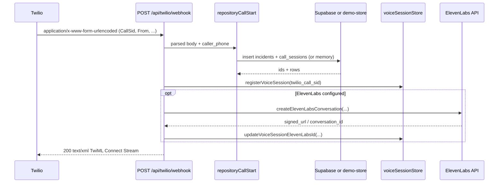
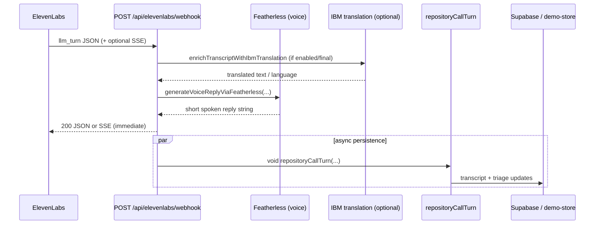

# Current Backend Architecture

This document describes the **backend as implemented** in this repository (Next.js Route Handlers under `app/api`, shared libraries under `lib/`, Supabase migrations). It is not a roadmap.

For a broader implementation-vs-planned audit (including dashboard realtime), see `docs/codebase_implementation_audit.md`. **Detailed triage/provider behavior** is summarized here only at integration boundaries; a dedicated triage doc may supersede that portion later.

---

## 1. Executive Summary

**Primary backend responsibilities**

- Expose **HTTP JSON/XML routes** for telephony ingress (**Twilio**, **ElevenLabs**), **call lifecycle** (`start` / `turn` / `end`), **operator mutations**, **demo simulations**, and **dev diagnostics**.
- Centralize **writes** to **`incidents`**, **`call_sessions`**, **`transcript_events`**, and **`audit_logs`** through **`lib/db/call-repository.ts`**, using **`getServiceRoleClient()`** when Supabase env vars are present.
- Run **structured call triage** (two-pass JSON agent + backend tool execution) inside **`repositoryCallTurn`** when a turn is marked final.
- Provide **Twilio REST** helpers for **transfer redirect** and **SMS**, with explicit **non-throwing stubs** when credentials are unset.

**Major runtime flows**

1. **Twilio PSTN → TwiML**: `POST /api/twilio/webhook` parses form body, calls **`repositoryCallStart`**, registers **`voiceSessionStore`**, returns TwiML to stream audio to ElevenLabs (`lib/voice/twilioClient.ts`).
2. **Programmatic / EL bootstrap**: `POST /api/call/start` or ElevenLabs fingerprint path calls **`repositoryCallStart`** with optional **`resolveCallerPhoneJsonOrTwilio`** (`lib/voice/callerPhoneResolution.ts`).
3. **Structured turn**: `POST /api/call/turn` → **`repositoryCallTurn`** (triage + DB updates).
4. **ElevenLabs Custom LLM**: `POST /api/elevenlabs/webhook` (`kind === "llm_turn"`) returns a **synchronous** Featherless voice reply (`generateVoiceReplyViaFeatherless`), while **`repositoryCallTurn`** is typically **`void`** (fire-and-forget) — **does not block** the HTTP response on triage completion (`app/api/elevenlabs/webhook/route.ts`).

**Major external services**

- **Supabase Postgres** (service role server writes; anon reads are a frontend concern).
- **Twilio** REST + TwiML (`lib/voice/twilioClient.ts`, `lib/voice/voiceConfig.ts`).
- **ElevenLabs** (agent/stream setup + webhook payloads; `createElevenLabsConversation`, webhook handler).
- **Featherless** OpenAI-compatible **`/chat/completions`** for (a) structured triage JSON (`lib/ai/providers/featherlessClient.ts`) and (b) short spoken replies in the ElevenLabs handler (`generateVoiceReplyViaFeatherless` in `app/api/elevenlabs/webhook/route.ts`).
- **Google Gemma** via Generative Language API (`lib/ai/providers/gemmaClient.ts`) as optional triage provider.
- **IBM watsonx.ai** (optional) for transcript translation / reply localization (`lib/voice/ibmLanguageTranslator.ts`, `lib/voice/transcriptTranslation.ts`), gated by **`IBM_TRANSLATION_ENABLED`**.

**Major fallback / mock behavior**

- **`getServiceRoleClient()` → null** ⇒ **`lib/server/demo-store.ts`** in-memory incidents/sessions/transcripts/audit (`repositoryCallStart` / `repositoryCallTurn` branches).
- **Twilio not configured** ⇒ SMS **`sendSms`** returns stub (`lib/voice/smsClient.ts`); transfer route may treat redirect as “success” without REST (`app/api/twilio/transfer/route.ts`).
- **Triage tools** (`lib/tools/*`) use **mock/static** geocode, responder ranking over **`getMockResponders()`**, bbox **event zones**, template **SMS draft** — not production GIS or DB responders.
- **ElevenLabs webhook signature**: **`verifyElevenLabsSignature`** returns **true** when **`ELEVENLABS_WEBHOOK_SECRET`** is empty (**verification disabled**) (`lib/voice/elevenlabsWebhookParser.ts`).
- **Transfer from EL Custom LLM path**: **`shouldTransfer`** and **`shouldEnd`** are **hardcoded `false`** (`app/api/elevenlabs/webhook/route.ts`) — **`triggerTransfer`** is effectively dead on that path.

**Biggest backend architecture risks**

1. **Split brain**: spoken line vs **`repositoryCallTurn`** structured **`say_to_caller`** / incident patches can diverge because voice and triage use **different model calls** and **async timing**.
2. **Transfer disconnected** from the primary ElevenLabs voice loop (constants above).
3. **`caller_phone` null** ⇒ operator SMS without explicit **`to`** fails recipient lookup (`repositoryLatestCallerPhoneForIncident`).
4. **Persistence opacity**: missing Supabase env silently switches entire fleet to **single-process memory** (`demo-store`), breaking multi-instance demos.

---

## 2. Backend Entry Points

| Route | Method | Purpose | Main Handler File | Main Internal Functions | Status |
|-------|--------|---------|-------------------|-------------------------|--------|
| `/api/call/start` | POST | Create incident + session (JSON); resolve caller phone | `app/api/call/start/route.ts` | `repositoryCallStart`, `resolveCallerPhoneJsonOrTwilio` | Implemented |
| `/api/call/turn` | POST | Append transcript; final turns run triage + patches | `app/api/call/turn/route.ts` | `repositoryCallTurn` | Implemented |
| `/api/call/end` | POST | Close session; update incident terminal state | `app/api/call/end/route.ts` | `repositoryCallEnd` | Implemented |
| `/api/twilio/webhook` | POST | Inbound call → start session → TwiML to ElevenLabs | `app/api/twilio/webhook/route.ts` | `repositoryCallStart`, `parseTwilioFormBody`, `buildTwimlConnectElevenLabs`, `registerVoiceSession`, `createElevenLabsConversation` | Implemented |
| `/api/twilio/status` | POST | Terminal Twilio status → end session | `app/api/twilio/status/route.ts` | `repositoryCallEnd`, `getSessionByTwilioSid` | Implemented |
| `/api/twilio/transfer` | POST | Redirect live call to operator; takeover + end session | `app/api/twilio/transfer/route.ts` | `repositoryMarkTransferBridging`, `redirectTwilioCall`, `repositoryOperatorTakeover`, `repositoryCallEnd`, `repositoryLogTransferCompleted` | Partially implemented (Twilio REST skipped when `twilioConfig.isConfigured` is false; redirect marked success — **stubbed**) |
| `/api/elevenlabs/webhook` | POST | EL events: Custom LLM, transcript, post-call | `app/api/elevenlabs/webhook/route.ts` | `parseElevenLabsEvent`, `verifyElevenLabsSignature`, `generateVoiceReplyViaFeatherless`, `repositoryCallStart`, `repositoryCallTurn`, `repositoryCallEnd`, `triggerTransfer` | Partially implemented (**Disconnected** transfer flags on `llm_turn`) |
| `/api/elevenlabs/webhook/chat/completions` | POST | Forward body/headers to main EL webhook (SSE-safe) | `app/api/elevenlabs/webhook/chat/completions/route.ts` | Internal `fetch` to `/api/elevenlabs/webhook` | Implemented |
| `/chat/completions` | POST | Same handler export as EL webhook (path shim for EL suffix) | `app/chat/completions/route.ts` | Re-exports `POST` from `app/api/elevenlabs/webhook/route.ts` | Implemented |
| `/api/operator/takeover` | POST | Operator assumes control | `app/api/operator/takeover/route.ts` | `repositoryOperatorTakeover` | Implemented |
| `/api/operator/update-incident` | POST | Patch incident fields | `app/api/operator/update-incident/route.ts` | `repositoryOperatorUpdateIncident` | Implemented |
| `/api/operator/resolve` | POST | Resolve incident + session | `app/api/operator/resolve/route.ts` | `repositoryOperatorResolve` | Implemented |
| `/api/operator/send-sms` | POST | Audit + send SMS via Twilio when configured | `app/api/operator/send-sms/route.ts` | `repositoryOperatorSendSms`, `repositoryLatestCallerPhoneForIncident`, `sendSms` | Partially implemented (**stubbed** SMS when Twilio unset) |
| `/api/simulate/disaster` | POST | Seed disaster-mode incidents/sessions | `app/api/simulate/disaster/route.ts` | `repositorySimulateDisaster` | Implemented (demo data) |
| `/api/simulate/world-cup` | POST | Seed world-cup incidents; returns **`event_layers`** when DB seeded | `app/api/simulate/world-cup/route.ts` | `repositorySimulateWorldCup` | Implemented (demo data) |
| `/api/surge/analyze` | POST | Run **`runSurgeGeoOpsAgent`** on demo-store incidents by default; returns JSON only | `app/api/surge/analyze/route.ts` | `runSurgeGeoOpsAgent`, `listAllIncidentsSorted`, `getMockResponders` | Partially implemented (**does not** call **`repositorySurgeAnalyze`**) |
| `/api/dev/incidents` | GET | List incidents for dashboard fallback API | `app/api/dev/incidents/route.ts` | `repositoryListIncidentsForDev` | Dev-only |
| `/api/dev/call-sessions` | GET | List sessions for incident | `app/api/dev/call-sessions/route.ts` | `repositoryListCallSessionsForDev` | Dev-only |
| `/api/dev/db-health` | GET | Probe Supabase tables via service role | `app/api/dev/db-health/route.ts` | `getServiceRoleClient` | Dev-only |
| `/api/dev/persistence` | GET | Expose whether service-role persistence is active | `app/api/dev/persistence/route.ts` | `usesSupabasePersistence` | Dev-only |
| `/api/dev/triage-preview` | POST | Dry-run triage JSON (no DB write path through repository) | `app/api/dev/triage-preview/route.ts` | `runVoiceSimTriagePreview` (`lib/simulate/voice-sim-triage-server.ts`) | Dev-only |
| `/api/responders/mock` | GET | Return static mock responder fleet JSON | `app/api/responders/mock/route.ts` | `getMockResponders` | Mocked |

---

## 3. Core Backend Modules

| Module/File | Responsibility | Key Exports/Functions | Depends On | Notes |
|-------------|----------------|----------------------|------------|-------|
| `lib/db/call-repository.ts` | Single aggregation point for call + operator + simulate + surge persistence | `repositoryCallStart`, `repositoryCallTurn`, `repositoryCallEnd`, `repositoryOperatorTakeover`, `repositoryOperatorUpdateIncident`, `repositoryOperatorResolve`, `repositoryOperatorSendSms`, `repositoryLatestCallerPhoneForIncident`, `repositorySimulateDisaster`, `repositorySimulateWorldCup`, `repositorySurgeAnalyze`, `repositoryListIncidentsForDev`, transfer helpers, `insertAudit` | `getServiceRoleClient`, `demo-store` fallbacks, AI agents, tools, merge/gate helpers | **`repositorySurgeAnalyze` is not referenced by any `app/api` route** (dead HTTP surface). |
| `lib/supabase/service.ts` | Service-role Supabase client singleton | `getServiceRoleClient`, `usesSupabasePersistence` | `@supabase/supabase-js`, `NEXT_PUBLIC_SUPABASE_URL`, `SUPABASE_SERVICE_ROLE_KEY` | Returns **`null`** if URL/key missing. |
| `lib/server/demo-store.ts` | In-memory persistence + audit helpers when Supabase absent | `createEmptyIncident`, `saveIncident`, `appendTranscriptEvent`, `newAuditLog`, `resetDemoStore`, getters/listers | Local IDs/time (`lib/server/ids.ts`, `iso-now.ts`) | **Not durable** across instances/restarts. |
| `lib/server/merge-triage-output.ts` | Apply validated AI patches to domain objects | `applyIncidentPatch`, `applyCallSessionPatch` | Domain types | Called from `repositoryCallTurn` after triage. |
| `lib/server/transferGate.ts` | Backend transfer policy after triage | `applyTransferGate` | `getOperatorAvailability`, incident/session shapes | **Env-hardcoded** availability (`OPERATOR_AVAILABILITY`). |
| `lib/server/operatorAvailability.ts` | Operator busy/free toggle | `getOperatorAvailability` | `process.env.OPERATOR_AVAILABILITY` | Default **`free`**. |
| `lib/server/api-route-helpers.ts` | Shared route JSON errors / repo error mapping | `jsonError`, `repositoryErrorResponse`, `zodToMessage` | — | Used across routes. |
| `lib/server/responders-mock-data.ts` | Static responder fleet | `getMockResponders` | — | Powers **`/api/responders/mock`** and **`responder_lookup`**. |
| `lib/server/simulate-seed-enrichment.ts` | Enrich seeded incidents | `mergeSimulatedSurgeRow` (and related) | Mock geometry | Used from simulate flows in `call-repository`. |
| `lib/voice/twilioClient.ts` | Twilio REST + TwiML | `parseTwilioFormBody`, `buildTwimlConnectElevenLabs`, `buildTwimlTransfer`, `redirectTwilioCall`, `sendTwilioSms`, `fetchTwilioCallCallerFrom`, `createElevenLabsConversation` | `voiceConfig` | Returns **`ok: false`** when Twilio not configured. |
| `lib/voice/voiceConfig.ts` | Env accessors | `twilioConfig`, `elevenLabsConfig`, `resolveOperatorForwardE164` | `process.env.*` | Documents stub/demo behavior in file header. |
| `lib/voice/voiceSessionStore.ts` | In-memory map Twilio SID / EL id → incident/session | `registerVoiceSession`, `getSessionByTwilioSid`, `patchVoiceSessionIds`, `patchVoiceTriageState` | — | **Process-local** only. |
| `lib/voice/elevenlabsWebhookParser.ts` | Parse + verify EL payloads | `parseElevenLabsEvent`, `verifyElevenLabsSignature` | Web Crypto | Empty secret ⇒ verification **skipped** (returns true). |
| `lib/voice/callerPhoneResolution.ts` | Extract phone from JSON tree or Twilio Calls API | `extractCallerPhoneFromJsonPayload`, `resolveCallerPhoneJsonOrTwilio` | `fetchTwilioCallCallerFrom` | Fails to **`null`** when no embedded phone and no resolvable CallSid. |
| `lib/voice/smsClient.ts` | SMS send facade | `sendSms` | `sendTwilioSms`, `twilioConfig` | **Stub** `{ sent: false, stub: true }` if Twilio unset. |
| `lib/voice/transcriptTranslation.ts` | Optional IBM layer before triage | `enrichTranscriptWithIbmTranslation` | `translateTextToEnglishWithIbm` | Disabled unless **`IBM_TRANSLATION_ENABLED==="true"`**. |
| `lib/voice/ibmLanguageTranslator.ts` | watsonx IAM + text generation | `translateTextToEnglishWithIbm`, `translateEnglishToLanguageWithIbm` | IBM env vars | Default model id **`ibm/granite-3-8b-instruct`**. |
| `lib/voice/callRouting.ts` | Shape OpenAI-compatible responses for EL | `buildElevenLabsLlmResponse` | — | Used when building JSON completion shape. |
| `lib/ai/agents/callTriageAgent.ts` | Provider selection + provenance for triage JSON | `runCallTriageAgent`, `runCallTriageAgentWithProvenance` | Featherless/Gemma/mock | Fallback to **`mockCallTriageAgent`**. |
| `lib/ai/agents/mockCallTriageAgent.ts` | Deterministic keyword triage | `mockCallTriageAgent` | Zod validation | **`system_actions`** always empty array. |
| `lib/ai/agents/surgeGeoOpsAgent.ts` | Deterministic surge clustering output | `runSurgeGeoOpsAgent` | Zod schema | Ignores **`provider`** (`void input.provider`). |
| `lib/ai/executeAllowedToolRequests.ts` | Execute whitelisted tool requests | `executeAllowedToolRequests` | `toolRegistry`, timeouts | Never throws per-tool; errors become **`ToolResult`**. |
| `lib/ai/toolRegistry.ts` | Registers safe tools + executors | `getToolDefinition`, `listToolDefinitions` | `lib/tools/*` | No **`mapbox_mcp`** executor registered. |
| `lib/tools/geocodeLocation.ts` | Mock geocode | `geocodeLocation` | `_mockGeo` | **Mocked**. |
| `lib/tools/responderLookup.ts` | Mock nearest responders | `responderLookup` | `getMockResponders`, Haversine | **Mocked**; marks source **`database`** in output despite mock fleet. |
| `lib/tools/eventZoneLookup.ts` | Static bbox zones | `eventZoneLookup` | `_mockGeo` | **Mocked**. |
| `lib/tools/smsDraft.ts` | Template SMS body | `smsDraft` | — | Does not send. |
| `lib/validation/api-requests.ts` | Zod schemas for HTTP bodies | `callStartRequestSchema`, `callTurnRequestSchema`, operator schemas, `simulateBatchRequestSchema`, etc. | Zod | Imported by routes. |
| `lib/types/api.ts` | Shared API DTO types | `CallStartRequest`, `TriageTrace`, etc. | Domain enums/types | Consumed by routes + frontend adapters. |

---

## 4. Persistence Architecture

**Service-role client**

- **`getServiceRoleClient`** (`lib/supabase/service.ts`) creates **`createClient(url, key)`** with **`auth: { persistSession: false }`** when **`NEXT_PUBLIC_SUPABASE_URL`** and **`SUPABASE_SERVICE_ROLE_KEY`** are non-empty; caches in module **`cached`**.

**When env vars are missing**

- **`getServiceRoleClient()` returns `null`**.
- **`repositoryCallStart` / `repositoryCallTurn` / `repositoryCallEnd`** and related functions take branches that read/write **`lib/server/demo-store.ts`** instead of Supabase.

**Tables used by backend TS (via Supabase client)**

- Writes/reads observed in **`lib/db/call-repository.ts`**: **`incidents`**, **`call_sessions`**, **`transcript_events`**, **`audit_logs`**, **`event_layers`** (SELECT only for world-cup simulation packaging / surge input).

**`responders` SQL table**

- Defined in **`supabase/migrations/20260506180000_project_details_section_12.sql`**. **No** `from("responders")` usage found in application TypeScript — **Referenced only** at persistence layer; runtime responders come from **`getMockResponders`**.

**Interaction model**

- **`incidents`**: canonical incident row; updated on triage merge, operator actions, call end, simulate seed, surge analyze (repository path), transfer rollback paths.
- **`call_sessions`**: one row per active call attempt; holds **`caller_phone`**, **`twilio_call_sid`**, **`elevenlabs_conversation_id`**, **`recent_transcript`** JSON, transfer flags; updated each turn and lifecycle events.
- **`transcript_events`**: append-only style inserts for each transcript line (plus optional **`speaker: "ai"`** line after triage in **`repositoryCallTurn`**).
- **`audit_logs`**: **`insertAudit`** / **`newAuditLog`** for **`call_start`**, **`call_turn_final`**, **`transfer_*`**, **`send_sms`**, **`surge_analyze`**, etc.

| Table | Purpose | Written By | Read By | Notes/Gaps |
|-------|---------|------------|---------|------------|
| `incidents` | Incident aggregate | `repositoryCallStart` (insert), `repositoryCallTurn` (update), operator repos, `repositoryCallEnd`, simulate/surge branches in `call-repository.ts`, transfer failure rollback | `repositoryCallTurn`, operator repos, `repositoryListIncidentsForDev`, `twilio/transfer` (`loadIncidentMode`) | — |
| `call_sessions` | Per-call state | Same repository functions | Same + **`repositoryLatestCallerPhoneForIncident`** | **`caller_phone`** nullable in practice on some EL paths. |
| `transcript_events` | Transcript log | `appendTranscriptSupabase` inside `repositoryCallTurn`; demo-store branch appends in memory | `repositoryCallTurn` (history query), dev listing via incidents feed (frontend) | — |
| `audit_logs` | Append-only audit trail | `insertAudit`, `newAuditLog` | **`GET /api/dev/db-health`** probes select | Not exhaustively covering every voice nuance (see §10). |
| `event_layers` | Geo overlays for modes | **SQL migrations only** (seed) — `20260509200000_seed_event_layers.sql` | `listEventLayerRecordsForMode` in `call-repository.ts` | App **does not insert** layers at runtime. |

**`caller_phone` lifecycle**

| Stage | Behavior |
|-------|----------|
| **Sources** | Twilio inbound **`From`** (`app/api/twilio/webhook/route.ts`); JSON extraction **`extractCallerPhoneFromJsonPayload`** / **`resolveCallerPhoneJsonOrTwilio`** (`lib/voice/callerPhoneResolution.ts`); Twilio Calls GET **`fetchTwilioCallCallerFrom`** when **`CA…`** sid present and Twilio configured. |
| **Written** | **`newCallSessionInsertRow`** includes **`caller_phone`** (`lib/db/call-session-row.ts`); **`repositoryCallStart`** passes parsed phone into insert for Supabase or demo-store session. |
| **Null risk** | ElevenLabs payloads often omit phone; fingerprint **`repositoryCallStart`** may pass **`null`** sid; **`resolveCallerPhoneJsonOrTwilio`** returns **`null`** → column unset. |
| **SMS dependency** | **`POST /api/operator/send-sms`**: if **`to`** omitted, **`repositoryLatestCallerPhoneForIncident`** selects latest session’s **`caller_phone`** (`call-repository.ts`). Empty ⇒ JSON response **`sent: false`** with error message (`app/api/operator/send-sms/route.ts`). |

**Supabase realtime**

- **Not implemented in backend** Route Handlers. Realtime subscriptions live in **browser** code (`lib/data/supabaseTranscriptDataSource.ts`, `lib/data/supabaseIncidentDataSource.ts`). Backend responsibility ends at **Postgres writes**.

---

## 5. Twilio Architecture

**Inbound webhook**

- **`POST /api/twilio/webhook`** (`app/api/twilio/webhook/route.ts`): **`parseTwilioFormBody`** → extract **`CallSid`**, **`CallStatus`**, **`From`** → **`repositoryCallStart`** with **`caller_phone: callerPhone`** → **`registerVoiceSession`** → if **`elevenLabsConfig.isConfigured`**, **`createElevenLabsConversation`** + **`updateVoiceSessionElevenLabsId`** → **`buildTwimlConnectElevenLabs`** returning XML.

**TwiML**

- **`buildTwimlConnectElevenLabs`**: prefers signed stream URL if provided; else WebSocket URL with **`agent_id`** (`lib/voice/twilioClient.ts`).
- **`buildTwimlTransfer`**: simple **`<Dial>`** to operator E.164 (`lib/voice/twilioClient.ts`).

**Transfer**

- **`POST /api/twilio/transfer`**: loads mode via **`getServiceRoleClient`** + **`mapIncidentRow`** (`app/api/twilio/transfer/route.ts`); **`resolveOperatorForwardE164`** (`voiceConfig.ts`); **`repositoryMarkTransferBridging`**; **`redirectTwilioCall`** with TwiML from **`buildTwimlTransfer`**; on success **`repositoryOperatorTakeover`**, **`repositoryCallEnd`** (reason **`transferred`**), **`repositoryLogTransferCompleted`**, **`removeVoiceSession`**.

**Status callback**

- **`POST /api/twilio/status`**: on terminal status, **`repositoryCallEnd`** (`app/api/twilio/status/route.ts`).

**SMS**

- **`sendSms`** (`lib/voice/smsClient.ts`) wraps **`sendTwilioSms`** (`twilioClient.ts`); requires **`TWILIO_ACCOUNT_SID`**, **`TWILIO_AUTH_TOKEN`**, **`TWILIO_PHONE_NUMBER`** (`twilioConfig.isConfigured`).

**Env vars (representative)**

- Documented in **`lib/voice/voiceConfig.ts`**: **`TWILIO_ACCOUNT_SID`**, **`TWILIO_AUTH_TOKEN`**, **`TWILIO_PHONE_NUMBER`**, **`TWILIO_OPERATOR_FORWARD_NUMBER`**, **`TWILIO_OPERATOR_FORWARD_NUMBER_ALT`**, plus ElevenLabs keys for adjacent behavior.

**Stub / fallback**

- **`twilioRequest`** returns **`ok: false`** when Twilio not configured (`twilioClient.ts`).
- **Transfer route**: if **`!twilioConfig.isConfigured`**, logs warn and sets **`transferOk = true`** without REST redirect (`app/api/twilio/transfer/route.ts`) — **stubbed success**.

**Inbound sequence (current implementation)**

---

## 6. ElevenLabs Architecture

**Webhook route**

- **`POST /api/elevenlabs/webhook`** (`app/api/elevenlabs/webhook/route.ts`): reads raw body; **`verifyElevenLabsSignature`**; **`parseElevenLabsEvent`** (`lib/voice/elevenlabsWebhookParser.ts`).

**Custom LLM path (`kind === "llm_turn"`)**

- Resolves **`incident_id` / `call_session_id`** from payload extras or **`voiceSessionStore`**; may spawn async **`repositoryCallStart`** for fingerprinted new calls.
- Builds **`sayToCaller`** via **`generateVoiceReplyViaFeatherless`** (Featherless **`/chat/completions`**, short **`max_tokens`**, 8s timeout) with optional IBM translation of caller text first (**`enrichTranscriptWithIbmTranslation`**).
- On Featherless failure/timeout, **`voiceFallback`** uses **regex keyword** routing (`app/api/elevenlabs/webhook/route.ts`).
- Returns **`buildLlmResponse`** as JSON or **SSE** immediately.

**Transcript event path (`kind === "transcript"`)**

- Requires final user utterance and existing **`voiceSessionStore`** entry; **`await repositoryCallTurn`** synchronously (`app/api/elevenlabs/webhook/route.ts`).

**Post-call (`kind === "post_call"`)**

- **`await repositoryCallEnd`** when session found.

**When `repositoryCallTurn` runs (Custom LLM)**

- After response path setup, **fire-and-forget** **`void repositoryCallTurn(...)`** (non-first-turn) or **`void realIdsReady.then(... repositoryCallTurn)`** (first turn after IDs patch) — HTTP response **does not await** triage (`app/api/elevenlabs/webhook/route.ts`).

**Does webhook wait for structured triage?**

- **No** for **`llm_turn`**: structured triage runs **asynchronously** after the voice reply is chosen.

**Transfer behavior**

- **`shouldTransfer`** and **`shouldEnd`** are **hardcoded `false`** (`app/api/elevenlabs/webhook/route.ts`). **`triggerTransfer`** exists but the branch selecting **`action.type === "transfer"`** is **unreachable** with current constants.

**ElevenLabs turn sequence (Custom LLM — current)**

---

## 7. AI / Triage Integration Point

**Invocation**

- **`repositoryCallTurn`** (`lib/db/call-repository.ts`): after inserting/appending the caller transcript for **`is_final: true`**, calls **`runTriageWithToolLoop`** (same file).

**`runTriageWithToolLoop` (behavioral contract)**

1. **`runCallTriageAgentWithProvenance`** pass 1 (`lib/ai/agents/callTriageAgent.ts`) with **`latestTranscript`**, **`transcriptHistory`**, **`mode`**, **`provider: process.env.AI_PROVIDER`** (implicit/explicit).
2. If **`tool_requests`** non-empty: **`executeAllowedToolRequests`** (`lib/ai/executeAllowedToolRequests.ts`).
3. Pass 2: **`runCallTriageAgentWithProvenance`** again with **`toolResults`** attached on input (`lib/ai/agents/types.ts` **`CallTriageAgentInput.toolResults`**), serialized through **`buildTriageUserMessage`** in providers (`lib/ai/providers/gemmaClient.ts`, reused by Featherless client).

**Outputs consumed**

- **`TriageAgentOutput`**: merged via **`applyIncidentPatch`** / **`applyCallSessionPatch`** (`lib/server/merge-triage-output.ts`), then **`applyTransferGate`** (`lib/server/transferGate.ts`).
- DB updates: **`incidents`** / **`call_sessions`** **`update`** calls in Supabase branch; demo-store **`saveIncident` / `saveCallSession`** in memory branch (`call-repository.ts`).
- Optional **AI transcript line**: if **`say_to_caller`** non-empty, **`appendTranscriptSupabase`** / demo-store append with **`speaker: "ai"`** (`repositoryCallTurn`).
- Audit: **`insertAudit`** / **`newAuditLog`** with **`action: "call_turn_final"`** and **`buildTriageAuditPatch`** payload (`call-repository.ts`).

**Tool execution**

- Backend-only registry **`lib/ai/toolRegistry.ts`**; dispatcher **`executeAllowedToolRequests`**. **LLM does not perform HTTP tool calls** — it emits **`tool_requests`** JSON; server executes.

**Fallback providers**

- **`runCallTriageAgentWithProvenance`**: Featherless/Gemma errors or missing keys ⇒ **`mockCallTriageAgent`** (`callTriageAgent.ts`). Mock emits **no** **`system_actions`** (`mockCallTriageAgent.ts` header/comments).

**Further detail**

- Cross-cutting triage/tool/provider audit: **`docs/codebase_implementation_audit.md`** §5 (until a dedicated triage architecture note exists).

---

## 8. Operator Actions Architecture

**Pattern**

- Routes validate JSON with **`lib/validation/api-requests.ts`** schemas, delegate to **`repositoryOperator*`** in **`call-repository.ts`**.

**Frontend callers (for boundary completeness)**

- **`lib/data/apiOperatorActions.ts`** posts to **`/api/operator/*`** from the browser — not server-side backend, but the **sole production caller** wired in dashboard code.

| Operator Action | API Route | DB Writes | External Service | Current Gap |
|-----------------|-----------|-----------|------------------|-------------|
| Takeover | `POST /api/operator/takeover` | `incidents`, `call_sessions`, `audit_logs` (via repo) | None | Must match Supabase vs demo-store deployment assumptions |
| Update incident | `POST /api/operator/update-incident` | `incidents`, `audit_logs` | None | — |
| Resolve | `POST /api/operator/resolve` | `incidents`, `call_sessions`, `audit_logs` | None | — |
| Send SMS | `POST /api/operator/send-sms` | `audit_logs` via **`repositoryOperatorSendSms`** | Twilio SMS when configured | **Recipient often missing** (`caller_phone`); **stub send** if Twilio unset |

**Transfer**

- Not an `/api/operator/*` route; **`POST /api/twilio/transfer`** is internal/server-initiated (EL **`triggerTransfer`** intended caller — currently disconnected on `llm_turn`).

---

## 9. Simulation / Demo Architecture

**Disaster**

- **`POST /api/simulate/disaster`** → **`repositorySimulateDisaster`** (`call-repository.ts`): seeds batches via internal **`repositorySimulateSeed`** pattern (`call-repository.ts` exports region ~ `repositorySimulateDisaster`), **`maxCap: 100`** enforced at route (`app/api/simulate/disaster/route.ts`).

**World Cup**

- **`POST /api/simulate/world-cup`** → **`repositorySimulateWorldCup`**: seeds incidents/sessions; **`listEventLayerRecordsForMode("world_cup")`** attaches **`event_layers`** from DB when Supabase live (`call-repository.ts`). If no client or empty table, **`event_layers`** array empty.

**Surge analyze HTTP**

- **`POST /api/surge/analyze`** (`app/api/surge/analyze/route.ts`): calls **`runSurgeGeoOpsAgent`** with incidents defaulting to **`listAllIncidentsSorted()`** from **`demo-store`** filtered — **not** the Supabase-backed **`repositoryListIncidentsForDev`** path. Responders default to **`getMockResponders()`**.

**`repositorySurgeAnalyze`**

- Implemented in **`call-repository.ts`** (updates **`cluster_id`** / **`priority_score`** on cohort incidents, audit row) but **no route invokes it** — **Disconnected** from HTTP surface.

**Real vs fake**

- Simulations write **real DB rows** when Supabase configured; otherwise **demo-store** only. GeoOps **`/api/surge/analyze`** output is **deterministic computation**, not an LLM (`surgeGeoOpsAgent.ts`).

---

## 10. Current Backend Problems

1. **ElevenLabs voice vs structured triage split** — Caller hears **`generateVoiceReplyViaFeatherless`** while **`repositoryCallTurn`** computes separate **`say_to_caller`** / patches asynchronously.**Why:** Operator/transcript truth diverges from spoken UX.**Files:** `app/api/elevenlabs/webhook/route.ts`, `lib/db/call-repository.ts`.**Smallest fix:** Drive spoken reply from completed **`repositoryCallTurn`** result (latency tradeoff), or remove parallel Featherless voice path for demo.

2. **Transfer hardcoded off on EL Custom LLM path** — **`shouldTransfer = false`** disables **`triggerTransfer`.Why:** Documented transfer architecture unreachable live.**Files:** `app/api/elevenlabs/webhook/route.ts`.**Smallest fix:** Set flags from triage output or synchronous **`repositoryCallTurn`** completion.

3. **`caller_phone` null risk** — SMS and auditing lose callee linkage.**Files:** `lib/voice/callerPhoneResolution.ts`, `repositoryCallStart`, `repositoryLatestCallerPhoneForIncident`.**Smallest fix:** Always pass Twilio **`CallSid`** into EL dynamic variables / enforce Twilio-first **`repositoryCallStart`** before EL turns.

4. **Mock tools presented as “tools”** — Geocode/responder/zones do not reflect production data.**Files:** `lib/tools/*.ts`, `lib/ai/toolRegistry.ts`.**Smallest fix:** Swap executors for real HTTP services behind same registry interface.

5. **demo-store fallback** — Silent loss of durability + multi-instance inconsistency.**Files:** `lib/supabase/service.ts`, `lib/server/demo-store.ts`, all `repository*` branches.**Smallest fix:** Fail fast in deploy env when service role missing, or health gate `/api/dev/persistence`.

6. **Weak audit provenance for voice** — Async **`void repositoryCallTurn`** errors only hit logs; HTTP response already succeeded.**Files:** `app/api/elevenlabs/webhook/route.ts`.**Smallest fix:** Await triage in demo-critical paths or push structured errors to **`audit_logs`**.

7. **Surge HTTP mismatch** — Operators/dashboard clustering narrative may assume **`repositorySurgeAnalyze`** persistence; HTTP route uses **`/api/surge/analyze`** + demo-store list.**Files:** `app/api/surge/analyze/route.ts`, `repositorySurgeAnalyze` in `call-repository.ts`.**Smallest fix:** Add route wrapping **`repositorySurgeAnalyze`** or change analyze route data source.

---

## 11. Evidence Appendix

**API routes**

- `app/api/call/start/route.ts`, `turn/route.ts`, `end/route.ts`
- `app/api/twilio/webhook/route.ts`, `status/route.ts`, `transfer/route.ts`
- `app/api/elevenlabs/webhook/route.ts`, `app/api/elevenlabs/webhook/chat/completions/route.ts`
- `app/chat/completions/route.ts`
- `app/api/operator/takeover/route.ts`, `update-incident/route.ts`, `resolve/route.ts`, `send-sms/route.ts`
- `app/api/simulate/disaster/route.ts`, `world-cup/route.ts`
- `app/api/surge/analyze/route.ts`
- `app/api/dev/incidents/route.ts`, `call-sessions/route.ts`, `db-health/route.ts`, `persistence/route.ts`, `triage-preview/route.ts`
- `app/api/responders/mock/route.ts`

**DB / repository**

- `lib/db/call-repository.ts`, `lib/db/call-session-row.ts`, `lib/db/incident-row.ts`, `lib/db/mappers.ts`
- `lib/server/demo-store.ts`

**Voice / Twilio / ElevenLabs**

- `lib/voice/twilioClient.ts`, `voiceConfig.ts`, `voiceSessionStore.ts`, `elevenlabsWebhookParser.ts`, `callerPhoneResolution.ts`, `smsClient.ts`, `transcriptTranslation.ts`, `ibmLanguageTranslator.ts`, `callRouting.ts`, `twilioTypes.ts`, `elevenlabsTypes.ts`

**AI / tools**

- `lib/ai/agents/callTriageAgent.ts`, `mockCallTriageAgent.ts`, `surgeGeoOpsAgent.ts`, `types.ts`
- `lib/ai/providers/featherlessClient.ts`, `gemmaClient.ts`
- `lib/ai/executeAllowedToolRequests.ts`, `lib/ai/toolRegistry.ts`
- `lib/ai/schemas/triageAgentOutputSchema.ts` (and related schemas under `lib/ai/schemas/`)
- `lib/tools/geocodeLocation.ts`, `responderLookup.ts`, `eventZoneLookup.ts`, `smsDraft.ts`, `lib/tools/_mockGeo.ts`

**Supabase / migrations**

- `lib/supabase/service.ts`
- `supabase/migrations/20260506180000_project_details_section_12.sql`, `add_caller_phone_to_call_sessions.sql`, `20260507194500_anon_select_incidents_sessions_transcripts.sql`, `20260509200000_seed_event_layers.sql`

**Frontend data callers (HTTP clients into this backend)**

- `lib/data/apiOperatorActions.ts`, `lib/data/simulationClient.ts`, `lib/data/apiIncidentDataSource.ts` (`/api/dev/incidents`)

**Tests (backend-focused)**

- `lib/db/call-repository.test.ts`, `lib/ai/agents/callTriageAgent.test.ts`, `lib/ai/executeAllowedToolRequests.test.ts`, `lib/validation/api-requests.test.ts`, `lib/server/api-route-helpers.test.ts`

**Package manifest**

- `package.json` (confirms Next.js + `@supabase/supabase-js` + `zod`; **no** Twilio SDK package — REST via `fetch`).

---

*End of document.*
