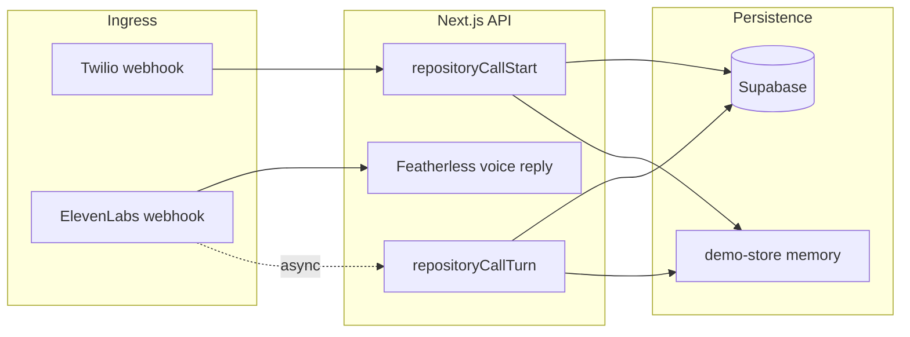

# ECC Codebase Implementation Audit

**Audit method:** Repository inspection (TypeScript/TSX routes, `lib/` modules, components, Supabase SQL migrations, Vitest tests). Commands run locally on this workspace: `npm run build` (succeeded), `npm run test:run` (87 tests passed), `npm run lint` (exit 0, 5 warnings).

---

## 1. Executive Summary

**What the repo contains**

- A **Next.js 16 App Router** app with a **dashboard** (`app/dashboard/page.tsx` → `components/dashboard/DashboardShell.tsx`) backed by **Mapbox GL JS** (`components/map/CommandMap.tsx` and layer components).
- **API routes** under `app/api/**` for call lifecycle (`call/start`, `call/turn`, `call/end`), **Twilio** (`twilio/webhook`, `twilio/transfer`, `twilio/status`), **ElevenLabs** (`elevenlabs/webhook` plus forwarding aliases), **operator actions**, **disaster/world-cup simulation**, **dev helpers**, and a standalone **`POST /api/surge/analyze`** implementation that does **not** wire the repository surge persistence helper used elsewhere.

**Actually working / implemented (with caveats)**

- **Incident + call session + transcript persistence** when `NEXT_PUBLIC_SUPABASE_URL` and `SUPABASE_SERVICE_ROLE_KEY` are set: inserts/updates in `incidents`, `call_sessions`, `transcript_events`, `audit_logs` via `lib/db/call-repository.ts` + `lib/supabase/service.ts`. Falls back to **in-memory** `lib/server/demo-store.ts` when the service client is null.
- **Structured call triage** on **`POST /api/call/turn`** (`repositoryCallTurn`): bounded **two model-call tool loop** (pass 1 → `executeAllowedToolRequests` → pass 2 with `tool_results` in the user payload). Implemented in `lib/db/call-repository.ts` (`runTriageWithToolLoop`).
- **Provider-backed triage**: Featherless or Gemma JSON completion (`lib/ai/agents/callTriageAgent.ts`, `lib/ai/providers/featherlessClient.ts`, `lib/ai/providers/gemmaClient.ts`) with **deterministic mock fallback** (`lib/ai/agents/mockCallTriageAgent.ts`).
- **Dashboard incident realtime**: Supabase `postgres_changes` subscription on `public.incidents` (`lib/data/supabaseIncidentDataSource.ts`). Transcript subscription per incident on `transcript_events` (`lib/data/supabaseTranscriptDataSource.ts`, used from `components/voice/LiveTranscriptPanel.tsx`).
- **Twilio inbound**: form-urlencoded webhook creates incident/session and returns TwiML to ElevenLabs stream (`app/api/twilio/webhook/route.ts`, `lib/voice/twilioClient.ts`).
- **ElevenLabs Custom LLM path**: HTTP handler returns SSE or JSON chat-completion-shaped replies (`app/api/elevenlabs/webhook/route.ts`); proxies exist at `app/api/elevenlabs/webhook/chat/completions/route.ts` and `app/chat/completions/route.ts`.
- **Transfer endpoint**: `POST /api/twilio/transfer` can Twilio-redirect a live call when Twilio is configured (`app/api/twilio/transfer/route.ts`).

**Mocked / hardcoded / disconnected**

- **Geocoding tool** is explicitly mock/static jitter (`lib/tools/geocodeLocation.ts`, `lib/tools/_mockGeo.ts`), not Mapbox Geocoding or MCP.
- **Responder lookup** uses **`getMockResponders()`** only (`lib/tools/responderLookup.ts`, `lib/server/responders-mock-data.ts`). **`responders` DB table is never queried** (grep finds no `.from("responders")` in TS).
- **Event zone lookup** uses static bbox fixtures (`lib/tools/eventZoneLookup.ts`, `lib/tools/_mockGeo.ts`).
- **SMS drafting tool** is a template (`lib/tools/smsDraft.ts`).
- **Mock triage agent** is keyword-driven and **`system_actions` is always empty** (`lib/ai/agents/mockCallTriageAgent.ts` comments + assignments).
- **Surge / “GeoOps” agent** `runSurgeGeoOpsAgent` is **deterministic clustering/math**, ignores `provider` (`lib/ai/agents/surgeGeoOpsAgent.ts` line noting `void input.provider`).
- **Operator availability** for transfers is **env toggle** `OPERATOR_AVAILABILITY` (`lib/server/operatorAvailability.ts`).
- **ElevenLabs `llm_turn` voice reply path**: spoken reply comes from a **separate short Featherless chat completion**, not from `repositoryCallTurn` output; **`shouldTransfer` / `shouldEnd` are hardcoded `false`**, so **transfer is never triggered** from this handler despite comments (`app/api/elevenlabs/webhook/route.ts`).

**Planned but missing or only partial**

- **Runtime Mapbox MCP**: token appears in schemas/comments/skills docs only — **no MCP client/server wiring** in application code (see §5.5).
- **`repositorySurgeAnalyze`** (persists `cluster_id` on incidents in DB/demo-store): **implemented but not exposed by any `app/api` route** (only referenced from tests).
- **`runControlledAgent`**: module exists (`lib/ai/agents/runControlledAgent.ts`) but **has zero importers** in TS sources — unused.

**Biggest architectural risks**

1. **Split brain on live voice**: caller hears **ad‑hoc Featherless prose**, while **`repositoryCallTurn` structured triage** runs asynchronously and may write a **different** `say_to_caller` into `transcript_events`.
2. **Transfer logic disconnected from Custom LLM path**: triage may approve transfer downstream, but the webhook never sets `shouldTransfer` / never calls `triggerTransfer` in the current code path.
3. **Hackathon demo fragility**: when Supabase env is missing, persistence silently degrades to memory (`getServiceRoleClient()` → null); realtime/anonymous policies depend on migrations (`supabase/migrations/*`).
4. **IBM dependency wording**: comments still mention “Watson Language Translator” while implementation uses **watsonx.ai generation + Granite default model** (`lib/voice/ibmLanguageTranslator.ts`).

---

## 2. Actual Tech Stack Detected

| Area | Detected Implementation | Evidence | Status |
|------|-------------------------|----------|--------|
| Next.js frontend | App Router pages `/`, `/dashboard`, `/dev/voice-sim` | `app/page.tsx`, `app/dashboard/page.tsx`, `app/dev/voice-sim/page.tsx` | Implemented |
| Next.js API/backend routes | `app/api/**/route.ts` (+ `/chat/completions` re-export) | Build route list from `npm run build` output | Implemented |
| Supabase / Postgres | `@supabase/supabase-js`, `@supabase/ssr`; service role for writes | `lib/supabase/service.ts`, `lib/supabase/client.ts`, `lib/db/call-repository.ts` | Partially implemented (requires env; falls back to demo-store) |
| Mapbox | `mapbox-gl` map + custom markers/layers | `components/map/CommandMap.tsx`, `package.json` | Implemented |
| Twilio | REST helpers + TwiML builders | `lib/voice/twilioClient.ts`, `app/api/twilio/*/route.ts` | Partially implemented (explicit stub modes when env absent, transfer skips redirect `transferOk = true` if “not configured”) |
| ElevenLabs | Webhook parser + voice reply + session store | `lib/voice/elevenlabsWebhookParser.ts`, `lib/voice/voiceSessionStore.ts`, `app/api/elevenlabs/webhook/route.ts` | Partially implemented (signature skipped when secret empty; transfer flags dead code — §5.4) |
| Featherless | OpenAI-compatible `chat/completions` for triage JSON and voice | `lib/ai/providers/featherlessClient.ts`, `app/api/elevenlabs/webhook/route.ts` | Implemented |
| IBM Watson STT | **Not implemented as IBM STT**; ElevenLabs provides transcripts | Comments reference ElevenLabs STT (`app/api/elevenlabs/webhook/route.ts`); no Watson STT client files found | Not found |
| IBM Language Translator | **Not legacy Translator API**; watsonx.ai generation prompts | `lib/voice/ibmLanguageTranslator.ts`, gated by `IBM_TRANSLATION_ENABLED` (`lib/voice/transcriptTranslation.ts`) | Partially implemented (optional; naming differs from docs) |
| IBM Granite | Default `IBM_WATSONX_MODEL_ID` uses `ibm/granite-3-8b-instruct` | `lib/voice/ibmLanguageTranslator.ts` | Implemented (as watsonx model id default) |
| Supabase realtime | `postgres_changes` channels | `lib/data/supabaseIncidentDataSource.ts`, `lib/data/supabaseTranscriptDataSource.ts` | Implemented (depends on Supabase replication/realtime + RLS policies from migrations) |
| Tests | Vitest unit tests under `lib/**` | 9 test files; `npm run test:run` 87 passed | Implemented |
| MCP / Mapbox MCP | Docs + Cursor `.agents/skills/*`; type union mentions `mapbox_mcp` | `lib/ai/toolResults.ts`; docs references only — **no `mcp.json` / `.cursor` MCP config in repo root glob search** | Referenced only / Not found (runtime) |
| AI agent framework | Custom orchestration in `call-repository`; no LangGraph/etc in deps | `package.json` dependencies | Hardcoded custom loop |

---

## 3. Current Runtime Architecture

**Frontend entry points**

- **`/`** — landing (`app/page.tsx`).
- **`/dashboard`** — operator UI (`DashboardShell`: queue, map, drawers, demo controls).
- **`/dev/voice-sim`** — simulated ElevenLabs flow (`components/dev/ElevenLabsVoiceSimulator.tsx`).

**Primary API routes (representative)**

- **Telephony ingress**: `POST /api/twilio/webhook` → `repositoryCallStart` → registers `voiceSessionStore` → TwiML to ElevenLabs (`app/api/twilio/webhook/route.ts`).
- **Alternative / programmatic starts**: `POST /api/call/start` (`app/api/call/start/route.ts`).
- **Turn ingestion / triage**: `POST /api/call/turn` → `repositoryCallTurn` (`app/api/call/turn/route.ts`, `lib/db/call-repository.ts`).
- **ElevenLabs**: `POST /api/elevenlabs/webhook` handles **Custom LLM**, transcript-shaped events, post-call (`app/api/elevenlabs/webhook/route.ts`).
- **Operator**: `/api/operator/takeover`, `update-incident`, `resolve`, `send-sms`.

**Data flow (verified)**

1. **Twilio-first**: Twilio form body → `repositoryCallStart` (Supabase or demo-store) → IDs stored in memory map keyed by CallSid (`registerVoiceSession`).
2. **ElevenLabs Custom LLM Turn**: JSON body → parse (`parseElevenLabsEvent`) → **Featherless voice reply returned synchronously** → **async** `repositoryCallTurn` persists transcript + runs structured triage when final (`app/api/elevenlabs/webhook/route.ts`).
3. **Dashboard**: Browser Supabase anon client loads incidents; optional realtime merges (`createSupabaseIncidentDataSource`).

**Database access pattern**

- **Writes**: almost exclusively **service role** server client (`getServiceRoleClient`).
- **Reads (dashboard)**: **anon** client (`createClient` from `lib/supabase/client.ts`) per migrations granting select access (`supabase/migrations/20260507194500_anon_select_incidents_sessions_transcripts.sql`).

**External HTTP**

- Featherless (`lib/ai/providers/featherlessClient.ts`, voice path in `app/api/elevenlabs/webhook/route.ts`).
- Optional Google Gemma API (`lib/ai/providers/gemmaClient.ts`).
- Optional IBM IAM + watsonx (`lib/voice/ibmLanguageTranslator.ts`).
- Twilio REST (`lib/voice/twilioClient.ts`).
- ElevenLabs conversation API (`createElevenLabsConversation` in `lib/voice/twilioClient.ts`).

**Simulation / dev-only**

- `POST /api/simulate/disaster`, `/api/simulate/world-cup` (wired through repository helpers in `call-repository.ts`).
- `POST /api/dev/triage-preview` — dry-run triage (`app/api/dev/triage-preview/route.ts`, `lib/simulate/voice-sim-triage-server.ts`).
- `/api/dev/incidents`, `/api/dev/call-sessions`, `/api/dev/db-health`, `/api/dev/persistence`.

**Realtime / polling**

- **Realtime**: Supabase channels for incidents + transcripts (above).
- **Polling-ish fallback**: `refreshIncidents` on API datasource (`lib/data/apiIncidentDataSource.ts` hitting `/api/dev/incidents`) when Supabase path unavailable — dashboard prefers realtime subscription when configured (`DashboardShell.tsx`).



*Diagram constraints:* Twilio path always hits `repositoryCallStart` synchronously. ElevenLabs `llm_turn` returns voice text **without waiting** for `repositoryCallTurn`; triage DB writes happen asynchronously after IDs resolve.

---

## 4. Feature Implementation Matrix

| Feature | Intended Behavior | Current Implementation | Evidence | Gap |
|---------|-------------------|------------------------|----------|-----|
| Live call registration | Create incident + session | **Twilio webhook** and **`/api/call/start`** call `repositoryCallStart` | `app/api/twilio/webhook/route.ts`, `app/api/call/start/route.ts`, `lib/db/call-repository.ts` | ElevenLabs fingerprint path uses async start + temp UUIDs — ordering-sensitive |
| Twilio inbound handling | TwiML connect | Parses form body, creates rows, TwiML `<Connect><Stream>` | `app/api/twilio/webhook/route.ts`, `lib/voice/twilioClient.ts` | Signature validation explicitly skipped for hackathon (`route.ts` comments) |
| ElevenLabs webhook handling | Events + LLM | Single POST handler branches on parsed kind | `app/api/elevenlabs/webhook/route.ts` | Transfer branch unreachable (`shouldTransfer = false`) |
| Transcript ingestion | Store caller text | `repositoryCallTurn` → `transcript_events` + `recent_transcript` | `lib/db/call-repository.ts` (`appendTranscriptSupabase`) | Partial utterances depend on `is_final` handling by callers |
| Live transcript display | Operator sees turns | Supabase fetch + realtime subscription | `lib/data/supabaseTranscriptDataSource.ts`, `components/voice/LiveTranscriptPanel.tsx` | Requires anon access + working realtime |
| Incident creation | DB row | Insert via service role or demo-store | `repositoryCallStart` | Without Supabase env, data not shared across instances |
| Call session creation | Linked session row | Same | `newCallSessionInsertRow` (`lib/db/call-session-row.ts`) | — |
| `caller_phone` storage | Persist E.164 | Column written on insert + mapped on updates | `lib/db/call-session-row.ts`, `repositoryCallStart`, `repositoryLatestCallerPhoneForIncident` | Often **null** if webhook JSON lacks phone and Twilio SID missing/mis-resolved (`lib/voice/callerPhoneResolution.ts`) |
| AI triage | Structured output | Two-pass loop + Zod validation (`validateTriageAgentOutput`) | `lib/db/call-repository.ts`, `lib/ai/schemas/triageAgentOutputSchema.ts` | Voice path does not speak triage output |
| Featherless integration | Model JSON | HTTP chat completions | `lib/ai/providers/featherlessClient.ts` | Optional `FEATHERLESS_JSON_RESPONSE` only |
| Fallback/mock AI | Deterministic | Keyword mock agent | `lib/ai/agents/mockCallTriageAgent.ts` | No transfer actions from mock |
| Structured AI output validation | Zod | `validateTriageAgentOutput` / merge helpers | `lib/ai/agents/callTriageAgent.ts`, `lib/server/merge-triage-output.ts` | Second-pass tool_requests ignored by design |
| Urgency classification | Enum patch | Model or mock emits `incident_patch` | Schema + mock branches | Mock uses keywords only |
| Incident type classification | Enum patch | Same | Same | Same |
| Location extraction | Text + coords | Patch fields + tool hydration | `hydrateIncidentPatchFromToolResults` in `call-repository.ts` | Mock geocoder dominates tool behavior |
| Geocoding | Real coords | Mock landmarks + jitter | `lib/tools/geocodeLocation.ts` | No Mapbox Geocoding API in repo |
| Mapbox incident pins | Markers | DOM markers from incidents | `components/map/CommandMap.tsx` | Pins depend on incident coordinates populated by triage/tools |
| Mapbox heatmap | Heat layer | `HeatmapLayer` component | `components/map/HeatmapLayer.tsx`, used from `CommandMap.tsx` | Visualization tied to incident props |
| Mapbox clusters | Surge clusters UI | **Client-derived** clusters `deriveSurgeClusters` | `lib/map/clustering.ts`, `DashboardShell.tsx` | Different from `repositorySurgeAnalyze` persistence (unused route) |
| Disaster/event mode | Mode-specific UX | Mode filter + simulation endpoints | `DemoControls.tsx`, `app/api/simulate/disaster/route.ts` | Simulation seeds data — not live hazard feeds |
| World Cup/event overlays | Extra layers | `EventLayer`, seeded `event_layers` when migrated | `components/map/EventLayer.tsx`, `repositorySimulateWorldCup` path in `call-repository.ts` | Depends on migration seed |
| Responder visualization | Map markers | Fetch `/api/responders/mock` | `lib/data/respondersClient.ts`, `ResponderLayer` via `CommandMap.tsx` | Always mock HTTP endpoint |
| Responder lookup tool | AI tool | Uses same mock fleet | `lib/tools/responderLookup.ts` | Not DB-backed |
| Operator takeover | State flip | API route | `app/api/operator/takeover/route.ts` | Must verify DB vs demo-store mirroring for env |
| Call transfer | Twilio redirect | `POST /api/twilio/transfer` | `app/api/twilio/transfer/route.ts` | **Not invoked** from ElevenLabs handler due to constant flags |
| SMS drafting | Template tool | `sms_draft` executor | `lib/tools/smsDraft.ts` | Does not send |
| SMS sending | Twilio SMS | `sendSms` wrapper | `lib/voice/smsClient.ts`, `app/api/operator/send-sms/route.ts` | Stub when Twilio env missing; recipient missing when `caller_phone` null |
| Incident resolve/update | Operator edits | `/api/operator/*` | `app/api/operator/resolve/route.ts`, `update-incident/route.ts` | — |
| Audit logs | Append rows | `insertAudit` / `newAuditLog` | `lib/db/call-repository.ts`, `lib/server/demo-store.ts` | Completeness depends on code paths hit |
| Supabase realtime | Live UI | Channels | `supabaseIncidentDataSource.ts` | Requires replication enabled + policies |
| Tests | Unit coverage | Vitest | `lib/**/*.test.ts` | No E2E twilio/elevenlabs integration tests in repo |

---

## 5. AI Agent Audit

### 5.1 Is there a real triage agent?

**Yes — conditional.** `runCallTriageAgentWithProvenance` selects:

- **`mock`**: deterministic **`mockCallTriageAgent`** (keyword rules; **`system_actions: []`** always).
- **`featherless`**: **`generateTriageJsonViaFeatherless`** then **`validateTriageAgentOutput`**, else mock fallback with `provider_error`.
- **`gemma`**: **`generateTriageJsonViaGemma`**, else mock fallback.

Files: `lib/ai/agents/callTriageAgent.ts`, providers above, schema validation `lib/ai/schemas/triageAgentOutputSchema.ts`.

So production behavior is **hybrid**: real LLM **when** env + provider succeed validation; otherwise **rules/mock**.

### 5.2 Is there a real geo-ops agent?

**No LLM GeoOps.** `runSurgeGeoOpsAgent` computes clusters deterministically and explicitly ignores `provider`:

```523:528:lib/ai/agents/surgeGeoOpsAgent.ts
export async function runSurgeGeoOpsAgent(
  input: RunSurgeGeoOpsAgentInput
): Promise<SurgeGeoOpsAgentOutput> {
  // `input.provider` is set for integration; model-backed GeoOps replaces this
  // deterministic implementation when ready (same public signature).
  void input.provider;
```

Operational geocoding for triage tools uses **`geocodeLocation`** mock landmarks/jitter (`lib/tools/geocodeLocation.ts`), not Mapbox APIs.

### 5.3 Are there real backend tools?

**Callable backend functions exist** and are registered in `lib/ai/toolRegistry.ts`, executed only through **`executeAllowedToolRequests`** (`lib/ai/executeAllowedToolRequests.ts`):

| Tool | Implementation nature |
|------|----------------------|
| `geocode_location` | Mock / static (`lib/tools/geocodeLocation.ts`) |
| `responder_lookup` | Mock fleet ranking (`lib/tools/responderLookup.ts`) |
| `event_zone_lookup` | Static zones (`lib/tools/eventZoneLookup.ts`) |
| `sms_draft` | Template (`lib/tools/smsDraft.ts`) |

**LLM tool calling (native provider-side tools):** **Not used.** Featherless/Gemma requests embed instructions + JSON context; tools are **requested as JSON fields** in `TriageAgentOutput`, then **backend executes** them between pass 1 and 2 (`lib/db/call-repository.ts`). The LLM does not invoke HTTP tools itself.

### 5.4 Is there an actual agentic loop?

**Partial, bounded two-step.**

- **Exists:** Up to **two** provider calls (`runTriageWithToolLoop`): first emits `tool_requests`, backend runs tools, second pass receives `tool_results` via **`buildTriageUserMessage`** (`lib/ai/providers/gemmaClient.ts` — also used by Featherless for message shape).
- **Does not exist:** Multi-turn arbitrary loops, provider-native tool rounds, retries beyond fallback-to-mock, feeding third-pass tool requests (explicitly discarded — comments in `call-repository.ts`).
- **Voice webhook divergence:** `app/api/elevenlabs/webhook/route.ts` runs **`generateVoiceReplyViaFeatherless`** (short prose model) **parallel** to async structured triage — **not** a unified agent loop.

Transfer decisions in voice handler are **disabled**:

```517:519:app/api/elevenlabs/webhook/route.ts
    let sayToCaller: string;
    const shouldTransfer = false;
    const shouldEnd = false;
```

### 5.5 Is Mapbox MCP implemented?

**Verdict:** **`Mapbox MCP status: Referenced only`** (for runtime application code).

**Evidence**

- **No** `mcp.json`, **no** `.cursor/` MCP config files found under repo root glob search performed during audit.
- **`mapbox_mcp`** appears as a **tool result source enum** (`lib/ai/toolResults.ts`) but **`lib/ai/toolRegistry.ts` does not register a Mapbox MCP executor** — only geocode/responder/event_zone/sms_draft.
- Documentation under `docs/` and `.agents/skills/*` discusses MCP for **human assistants**, not a bundled MCP server in this Next.js app.

---

## 6. Database / Data Model Audit

**Schema / migrations**

- Core tables defined in `supabase/migrations/20260506180000_project_details_section_12.sql`: `incidents`, `call_sessions`, `transcript_events`, `audit_logs`, `responders`, `event_layers`.
- **`caller_phone`** added on `call_sessions` in `supabase/migrations/add_caller_phone_to_call_sessions.sql` (refer to file name in repo).

**TypeScript types**

- Domain types under `lib/types/` (consumed by dashboard + repository mappers `lib/db/mappers.ts`).

**API usage**

- Heavy read/write through `lib/db/call-repository.ts` when service role configured.

**`responders` table**

- Created by migration but **application code does not query it**; fleet comes from mock JSON.

**`caller_phone` lifecycle**

- Twilio path: `body.From` passed into `repositoryCallStart` (`app/api/twilio/webhook/route.ts`).
- JSON APIs / ElevenLabs: `resolveCallerPhoneJsonOrTwilio` tries nested keys then Twilio Calls GET (`lib/voice/callerPhoneResolution.ts`, `fetchTwilioCallCallerFrom` in `lib/voice/twilioClient.ts`).
- **Loss scenarios:** ElevenLabs payloads often omit phone; without **`CA…`** CallSid or Twilio credentials, resolution returns **null** → SMS recipient lookup fails (`repositoryLatestCallerPhoneForIncident`, `app/api/operator/send-sms/route.ts`).

**Docs vs implementation**

- IBM layer docs mention Watson Translator; code uses **watsonx.ai** (`lib/voice/ibmLanguageTranslator.ts`).
- API contracts may describe surge persistence via backend analyze — **`repositorySurgeAnalyze` is not mounted on HTTP** (only tests).

---

## 7. Dashboard / Mapbox Audit

**Main dashboard**

- `components/dashboard/DashboardShell.tsx`: **TopBar**, **IncidentQueue**, **CommandMap**, drawers (`IncidentDrawer`, `ClusterDrawer`), **DemoControls**.

**Mapbox**

- `CommandMap.tsx`: initializes `mapboxgl.Map`, terrain/fog, incident markers (`createIncidentMarkerElement`), imports **`HeatmapLayer`**, **`ClusterLayer`**, **`DisasterStaticLayers`**, **`EventLayer`**, **`ResponderLayer`**.

**Data connection**

- Incidents: **Supabase anon** fetch + realtime (`createSupabaseIncidentDataSource`).
- If Supabase errors / empty: merges **static fallback incidents** (`dashboardFallbackIncidents` referenced in `supabaseIncidentDataSource.ts`).
- Responders: **`/api/responders/mock`** — **mock HTTP only** (`lib/data/respondersClient.ts`).
- Clusters: computed client-side **`deriveSurgeClusters`** (`lib/map/clustering.ts`), optionally grouping by `incident.cluster_id` when present.

**Operator actions**

- Wired through **`apiOperatorActions`** → `/api/operator/*` (`lib/data/apiOperatorActions.ts`).

**Demo controls**

- Calls **`postSimulateDisaster` / `postSimulateWorldCup`** (`components/dashboard/DemoControls.tsx`, `lib/data/simulationClient.ts`).

---

## 8. API Routes Audit

| Route | Purpose | Reads/Writes DB? | External Service? | Status | Evidence |
|-------|---------|------------------|-------------------|--------|----------|
| `POST /api/call/start` | Start call session | Writes when Supabase configured | Optional Twilio lookup | Implemented | `app/api/call/start/route.ts` |
| `POST /api/call/turn` | Transcript + triage | Writes transcript + patches | Featherless/Gemma optional | Implemented | `app/api/call/turn/route.ts` |
| `POST /api/call/end` | Close session | Writes | No | Implemented | `app/api/call/end/route.ts` |
| `POST /api/twilio/webhook` | Inbound voice | Writes start | Twilio + ElevenLabs setup | Implemented | `app/api/twilio/webhook/route.ts` |
| `POST /api/twilio/status` | Status callbacks | Writes end | No | Implemented | `app/api/twilio/status/route.ts` |
| `POST /api/twilio/transfer` | Operator bridge | Writes transfer lifecycle | Twilio REST | Partially implemented | Stub redirect success if Twilio “not configured” (`route.ts`) |
| `POST /api/elevenlabs/webhook` | EL events + LLM | Writes via async turn | Featherless + optional IBM | Partially implemented | Transfer flags never true |
| `POST /api/elevenlabs/webhook/chat/completions` | Forward to main webhook | Same as above | Same | Implemented | `app/api/elevenlabs/webhook/chat/completions/route.ts` |
| `POST /chat/completions` | EL suffix shim | Re-exports webhook | Same | Implemented | `app/chat/completions/route.ts` |
| `POST /api/operator/takeover` | Operator state | Writes | No | Implemented | `app/api/operator/takeover/route.ts` |
| `POST /api/operator/update-incident` | Patch incident | Writes | No | Implemented | `app/api/operator/update-incident/route.ts` |
| `POST /api/operator/resolve` | Resolve | Writes | No | Implemented | `app/api/operator/resolve/route.ts` |
| `POST /api/operator/send-sms` | SMS | Writes audit | Twilio SMS optional | Partially implemented | `sendSms` stub mode (`lib/voice/smsClient.ts`) |
| `GET /api/responders/mock` | Mock responders | No | No | Mocked | `app/api/responders/mock/route.ts` |
| `POST /api/simulate/disaster` | Seed incidents | Writes | No | Simulated | `app/api/simulate/disaster/route.ts` |
| `POST /api/simulate/world-cup` | Seed incidents + layers | Writes | No | Simulated | `app/api/simulate/world-cup/route.ts` |
| `POST /api/surge/analyze` | GeoOps JSON analysis | **Does not use `repositorySurgeAnalyze`** | No | Partially implemented | Uses demo-store defaults (`app/api/surge/analyze/route.ts`) |
| `GET /api/dev/incidents` | List incidents | Reads | No | Dev | `app/api/dev/incidents/route.ts` |
| `GET/POST /api/dev/call-sessions` | Sessions | Reads | No | Dev | `app/api/dev/call-sessions/route.ts` |
| `GET /api/dev/db-health` | Health | Reads | Supabase | Dev | `app/api/dev/db-health/route.ts` |
| `GET /api/dev/persistence` | Flags service role presence | No DB | No | Dev | `app/api/dev/persistence/route.ts` |
| `POST /api/dev/triage-preview` | Dry-run triage | No persist | Featherless/Gemma/mock | Dev | `app/api/dev/triage-preview/route.ts` |

*(Implementations not opened line-by-line in this audit are still present under `app/api/` — treat as implemented stub unless code inspection shows otherwise.)*

---

## 9. Testing / Verification

**Scripts (`package.json`)**

- `dev`, `build`, `start`, `lint`, `test`, `test:run`, `typecheck`.

**Framework**

- Vitest (`vitest`).

**Coverage (discovered)**

- **9** test files, **87** tests — all passed on `npm run test:run`.
- Focus areas: triage agent/provider fallback (`callTriageAgent.test.ts`), mock triage geocode two-pass (`mockCallTriageAgent.test.ts`), tool dispatcher (`executeAllowedToolRequests.test.ts`), repository in-memory (`call-repository.test.ts`), validation schemas (`api-requests.test.ts`), mappers, surge input builder, Gemma JSON parsing, route helpers.

**Not covered (observed)**

- No automated integration tests for Twilio webhooks, ElevenLabs SSE streaming, Mapbox runtime, or Supabase realtime subscriptions.

**Commands**

- `npm run build`: **succeeded** (Next.js 16.2.6). Warning about multiple lockfiles / inferred workspace root.
- `npm run test:run`: **succeeded** (87 tests).
- `npm run lint`: **exit 0**, warnings only (`CommandMap.tsx` unused vars; unused type import in `lib/ai/toolResults.ts`).

---

## 10. Critical Gaps Before Demo

1. **Voice vs triage semantic split** — Caller hears ad-hoc Featherless voice output while structured triage (`say_to_caller`) lands in DB/transcripts separately. **Why it matters:** Operators see text inconsistent with what caller heard. **Files:** `app/api/elevenlabs/webhook/route.ts`, `lib/db/call-repository.ts`. **MVP fix:** Return triage `say_to_caller` (or a deterministic template derived from validated JSON) as the Custom LLM response when turn save completes, or block voice until triage finishes (latency tradeoff).

2. **Transfer never fires from ElevenLabs Custom LLM path** — `shouldTransfer` hardcoded `false`. **Why:** Demo cannot show automatic bridge despite backend transfer gate existing elsewhere. **Files:** `app/api/elevenlabs/webhook/route.ts`. **MVP fix:** Derive transfer intent from latest `repositoryCallTurn` result or synchronous triage before responding (accept latency), then call `triggerTransfer`.

3. **`caller_phone` often null on EL-first flows** — Breaks SMS default recipient. **Files:** `lib/voice/callerPhoneResolution.ts`, `repositoryLatestCallerPhoneForIncident`. **MVP fix:** Ensure Twilio CallSid always forwarded into EL custom payload / dynamic variables; enforce Twilio-first webhook ordering.

4. **Mock geocode/responder/tools** — Sponsor story may imply real Mapbox/DB responders. **Files:** `lib/tools/geocodeLocation.ts`, `lib/tools/responderLookup.ts`. **MVP fix:** Swap executors for real HTTP geocode + optional responders table reads.

5. **Surge persistence disconnected** — `repositorySurgeAnalyze` never HTTP-mounted; dashboard clusters mostly local derivation. **Files:** `lib/db/call-repository.ts`, `lib/map/clustering.ts`. **MVP fix:** Add thin route wrapping `repositorySurgeAnalyze` or call it post-simulation.

6. **Mock triage never escalates transfers** — Featherless/Gemma must emit `system_actions` / `operator_required` for `applyTransferGate` to approve. **Files:** `lib/ai/agents/mockCallTriageAgent.ts`, `lib/server/transferGate.ts`. **MVP fix:** Ensure provider prompts + env keys actually hit Featherless in demo; avoid silent fallback to mock without noticing (`provider_error` logs).

7. **Operational security toggles** — ElevenLabs webhook accepts unsigned traffic when secret unset (`verifyElevenLabsSignature`). Twilio signature skipped. **Why:** Spoofed demos / stray traffic. **Files:** `lib/voice/elevenlabsWebhookParser.ts`, `app/api/twilio/webhook/route.ts`.

---

## 11. Recommended Next Implementation Steps

### Must Fix Before Demo

1. Decide single source of truth for **spoken** reply vs **`repositoryCallTurn` JSON** and align ElevenLabs handler.
2. Wire **`shouldTransfer`** (and operator availability) to real signals from triage output or incident/session flags.
3. Validate **`caller_phone`** end-to-end on the exact Twilio→ElevenLabs path you will use; fix SMS path accordingly.
4. Confirm **`AI_PROVIDER`, Featherless keys, Supabase keys** on the deployment actually match what you narrate (avoid silent mock fallback).

### Nice to Have

- HTTP route for **`repositorySurgeAnalyze`** to persist `cluster_id` aligned with dashboard narrative.
- Replace mock geocoder with Mapbox Geocoding API server-side (still “backend validates tools” pattern).
- Populate **`responders`** table + read API instead of mock HTTP.

### Do Not Build Yet

- Full **runtime Mapbox MCP** toolchain inside Next.js unless sponsor explicitly requires MCP protocol vs simple REST geocode.
- Arbitrary multi-hop agent frameworks — current bounded loop is easier to demo reliably.

---

## 12. Evidence Appendix

### Frontend / dashboard

- `app/dashboard/page.tsx`, `components/dashboard/DashboardShell.tsx`, `components/dashboard/DemoControls.tsx`, `components/dashboard/TopBar.tsx`
- `components/map/CommandMap.tsx`, `components/map/HeatmapLayer.tsx`, `components/map/ClusterLayer.tsx`, `components/map/EventLayer.tsx`, `components/map/DisasterStaticLayers.tsx`, `components/map/ResponderLayer.tsx`
- `lib/data/supabaseIncidentDataSource.ts`, `lib/data/supabaseTranscriptDataSource.ts`, `lib/data/respondersClient.ts`, `lib/data/apiOperatorActions.ts`
- `lib/map/clustering.ts`

### API routes

- `app/api/call/start/route.ts`, `app/api/call/turn/route.ts`, `app/api/call/end/route.ts`
- `app/api/twilio/webhook/route.ts`, `app/api/twilio/transfer/route.ts`, `app/api/twilio/status/route.ts`
- `app/api/elevenlabs/webhook/route.ts`, `app/api/elevenlabs/webhook/chat/completions/route.ts`, `app/chat/completions/route.ts`
- `app/api/operator/send-sms/route.ts`, `takeover`, `resolve`, `update-incident`
- `app/api/simulate/disaster/route.ts`, `app/api/simulate/world-cup/route.ts`
- `app/api/surge/analyze/route.ts`
- `app/api/dev/*`

### AI / agents

- `lib/ai/agents/callTriageAgent.ts`, `mockCallTriageAgent.ts`, `surgeGeoOpsAgent.ts`, `types.ts`, `runControlledAgent.ts` *(unused importers)*
- `lib/ai/providers/featherlessClient.ts`, `gemmaClient.ts`
- `lib/ai/executeAllowedToolRequests.ts`, `lib/ai/toolRegistry.ts`
- `lib/ai/prompts/callTriagePrompt.ts`
- `lib/ai/schemas/triageAgentOutputSchema.ts`
- `lib/db/call-repository.ts` (`runTriageWithToolLoop`, `repositoryCallTurn`)
- `lib/server/transferGate.ts`, `lib/server/operatorAvailability.ts`, `lib/server/merge-triage-output.ts`

### Supabase / DB

- `lib/supabase/service.ts`, `lib/supabase/client.ts`
- `lib/db/call-session-row.ts`, `lib/db/incident-row.ts`, `lib/db/mappers.ts`
- `supabase/migrations/*.sql`

### Twilio / ElevenLabs / voice

- `lib/voice/twilioClient.ts`, `voiceConfig.ts`, `voiceSessionStore.ts`, `callerPhoneResolution.ts`, `elevenlabsWebhookParser.ts`, `smsClient.ts`
- `lib/voice/transcriptTranslation.ts`, `ibmLanguageTranslator.ts`

### Mapbox

- `components/map/*`, `lib/map/*`, `package.json` (`mapbox-gl`)

### Tests

- `lib/**/*.test.ts` (9 files), `npm run test:run` output

### Docs / assistant tooling *(not runtime)*

- `docs/**/*.md`, `.agents/skills/**/*.md`

### Expected-but-not-found *(for MCP runtime integration)*

- No `mcp.json` at repo root (glob search).
- No `.cursor/` directory in workspace snapshot for MCP config.
- No application code importing an MCP client SDK.

### Repository searches performed *(keywords)*

Searches run during audit included: `triage`, `agent`, `Featherless`, `featherless`, `Gemini`, `Granite`, `Watson`, `ElevenLabs`, `elevenlabs`, `Twilio`, `twilio`, `caller_phone`, `call_sessions`, `incidents`, `transcript_events`, `audit_logs`, `Mapbox`, `mapbox`, `MCP`, `mcp`, `geocode`, `responder`, `transfer`, `sms`, `realtime`, `supabase`, `mock`, `fallback`, `hardcoded`, `simulation`, `.from("responders")`, `runControlledAgent`, `repositorySurgeAnalyze`.

---

*End of audit.*
