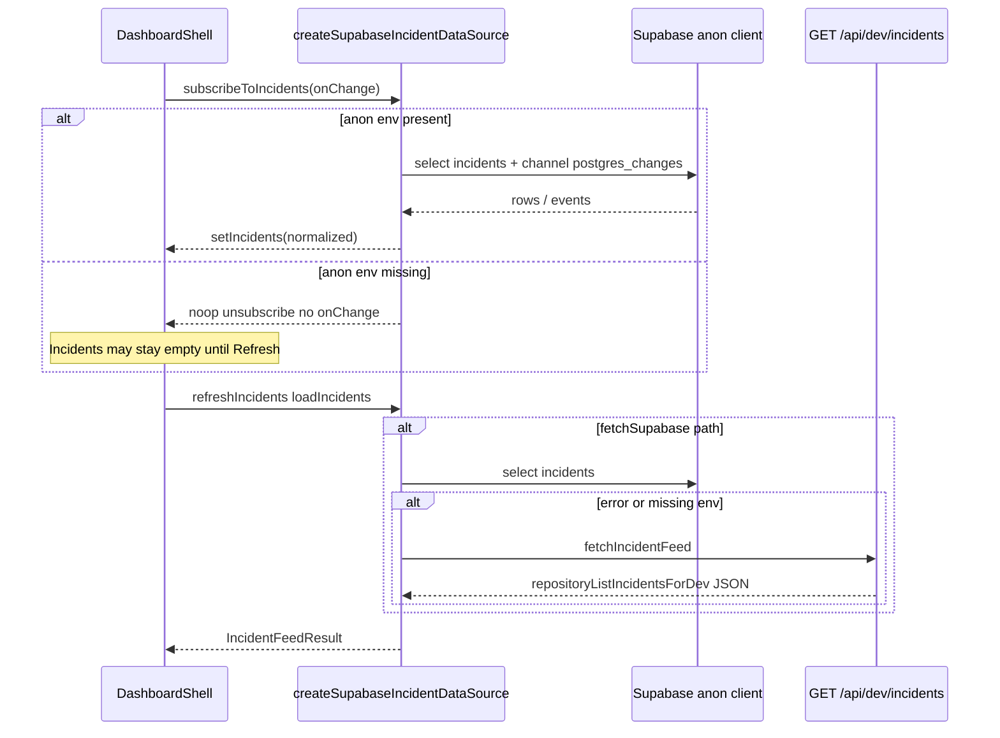

# Frontend ↔ Backend Dataflow

Orientation read: `docs/backend_architecture_current.md`, `docs/triage_agent_current_runtime.md`. **Claims below are verified against source code**, including fallback paths that those summaries only imply.

---

## 1. Executive Summary

**What the dashboard displays**

- **`DashboardShell`** (`components/dashboard/DashboardShell.tsx`) renders **TopBar** metrics/filters, **IncidentQueue**, center **CommandMap**, **DemoControls**, and either **IncidentDrawer** (single incident) or **ClusterDrawer** (selected derived cluster).

**Where data comes from**

- **Incidents**: **`createSupabaseIncidentDataSource`** (`lib/data/supabaseIncidentDataSource.ts`) — browser **`createClient`** (`lib/supabase/client.ts`) **SELECT `*` from `public.incidents`** (limit 200) plus **`postgres_changes`** realtime on **`public.incidents`**. When anon URL/key missing, **`fetchSupabaseIncidents`** delegates to **`apiIncidentDataSource`** → **`GET /api/dev/incidents`** (`lib/data/apiIncidentDataSource.ts`, `app/api/dev/incidents/route.ts`).
- **Call sessions** (drawer support panel): **`fetchCallSessionsForIncident`** (`lib/data/dashboardIncidentFeed.ts`) → **`GET /api/dev/call-sessions`**.
- **Transcripts**: **`fetchTranscriptEventsForIncident`** + **`subscribeTranscriptEventsForIncident`** (`lib/data/supabaseTranscriptDataSource.ts`) → **`transcript_events`** via anon Supabase.
- **Operator mutations**: **`apiOperatorActions`** (`lib/data/apiOperatorActions.ts`) → **`POST /api/operator/*`** (thin wrappers around **`repositoryOperator*`** on server).
- **Responders map layer**: **`respondersClient.getResponders`** (`lib/data/respondersClient.ts`) → **`GET /api/responders/mock`**.
- **Simulations**: **`postSimulateDisaster` / `postSimulateWorldCup`** (`lib/data/simulationClient.ts`) → **`POST /api/simulate/*`**.

**Realtime**

- **Incidents**: **Realtime yes**, when **`NEXT_PUBLIC_SUPABASE_URL`** + **`NEXT_PUBLIC_SUPABASE_PUBLISHABLE_KEY`** / **`NEXT_PUBLIC_SUPABASE_ANON_KEY`** (`lib/supabase/env.ts`) are set — channel **`dashboard-incidents-live`** (`supabaseIncidentDataSource.ts`).
- **Transcripts**: **Realtime yes** under same env — **`dashboard-transcript-{incidentId}`** channel filtered by **`incident_id`** (`supabaseTranscriptDataSource.ts`).

**Mock / static / client-derived**

- **`dashboardFallbackIncidents`** when Supabase/API returns empty or errors (`supabaseIncidentDataSource.ts`, `apiIncidentDataSource.ts` → `lib/mock/dashboardFallbackData.ts`).
- **Clusters**: **`getDisplaySurgeClusters` → `deriveSurgeClusters`** (`lib/map/clustering.ts`) — **client-side** grid/`cluster_id` grouping; **`mockSurgeClusters`** fallback only when there are incidents **without valid coordinates**.
- **Disaster map overlays**: **`DisasterStaticLayers`** uses **`lib/mock/disasterLayers.ts`** (static GeoJSON shapes).
- **World Cup map overlays**: **`EventLayer`** defaults to **`worldCupEventLayers`** from **`lib/mock/worldCupLayers.ts`** unless a **`layers`** prop is passed (**not wired from dashboard** — **`CommandMap`** omits `layers`).
- **Responders**: **`getMockResponders`** on server (`app/api/responders/mock/route.ts`).
- **Mapbox MCP / backend geo tools**: **Not found** in dashboard runtime — map uses **`mapbox-gl`** + env **`NEXT_PUBLIC_MAPBOX_TOKEN`** only (`components/map/CommandMap.tsx`).

**Biggest integration risks**

1. **`DashboardShell` + missing browser Supabase env**: **`subscribeToIncidents`** returns a **no-op** without calling **`onChange`** (`supabaseIncidentDataSource.ts`); another effect **skips** **`getInitialIncidents`** whenever **`subscribeToIncidents` is defined** (always provided by **`createSupabaseIncidentDataSource`** — `lib/data/incidentDataSource.ts` optional field vs concrete factory). **`onChange`** never runs ⇒ **`loadIncidents`-only paths never run on mount**, so **`loadState`** can remain **`"loading"`** with **`incidents === []`** until the user clicks **Refresh** (`TopBar` → **`loadIncidents`** → **`refreshIncidents`** / API fallback in `fetchSupabaseIncidents`).
2. **Split brain**: Live PSTN speech vs **`transcript_events`** / incident fields from **`repositoryCallTurn`** (see triage doc — `docs/triage_agent_current_runtime.md`).
3. **SMS**: **`CallControlPanel`** depends on backend resolving **`caller_phone`** — failures surface as API error/neutral message (`components/voice/CallControlPanel.tsx`).
4. **Clusters**: UI clusters **do not** come from **`POST /api/surge/analyze`** or **`repositorySurgeAnalyze`** — purely **client-derived** from visible incidents (`DashboardShell.tsx`, `clustering.ts`).

---

## 2. Dashboard Component Map

| Component | Purpose | Data Source | Backend/API Dependency | Notes |
|-----------|---------|-------------|----------------------|-------|
| **`DashboardShell`** | Layout, state, wiring | React state fed by data libs | Supabase anon + `/api/dev/*` + simulations | **`visibleIncidents`** = filtered **`incidents`** |
| **`TopBar`** | Mode, metrics, refresh | **`incidents`** prop | None directly — refresh triggers **`loadIncidents`** | **`realtimeConnected`** from **`SupabaseIncidentSourceStatus`** |
| **`IncidentQueue`** | Select/filter incidents | **`visibleIncidents`**, **`allIncidents`** | Inherited from shell state | Client-side filters only |
| **`IncidentDrawer`** | Detail tabs | **`Incident`**, **`activeCallSession`**, **`apiOperatorActions`** | **`GET /api/dev/call-sessions`** via **`fetchCallSessionsForIncident`** | **`LiveTranscriptPanel`** inside **“Live voice”** tab |
| **`ClusterDrawer`** | Cluster summary | **`SurgeCluster`** + **`incidents`** | None — cluster object from parent | Uses **`lib/map/clustering`** helpers |
| **`CommandMap`** | Mapbox GL map | **`incidents`**, **`clusters`**, **`responders`** | **`NEXT_PUBLIC_MAPBOX_TOKEN`**; responders → **`/api/responders/mock`** | **`CommandMapOffline`** if token missing |
| **`LiveTranscriptPanel`** | Transcript list + export | **`fetchTranscriptEventsForIncident`**, realtime subscribe | **`transcript_events`** via anon Supabase | **Errors** if anon env missing (`LiveTranscriptPanel.tsx`) |
| **`DemoControls`** | Simulate / refresh | **`simulationClient`** / callbacks | **`POST /api/simulate/disaster`**, **`world-cup`** | **`onAfterSimulation`** → **`refetchIncidentsQuiet`** |
| **`CallControlPanel`** | Operator buttons | **`incident`**, **`operatorActions`** | **`POST /api/operator/*`** via **`apiOperatorActions`** | No **Transfer** button |
| **`HeatmapLayer`** | Density viz | **`incidents`** prop | None | Uses incidents with coordinates |
| **`ClusterLayer`** | Cluster hulls | **`clusters`** prop | None | Driven by **`deriveSurgeClusters`** output |
| **`EventLayer`** | WC/event polygons | Default **`worldCupEventLayers`** mock | None unless **`layers`** prop added | **Not** loading **`event_layers`** table in **`CommandMap`** |
| **`DisasterStaticLayers`** | Zones/roads | **`disasterImpactZones`**, **`blockedRoadLayers`** mock | None | Static mock GeoJSON |
| **`ResponderLayer`** | Responder markers | **`responders`** from **`respondersClient`** | **`GET /api/responders/mock`** | Mock fleet |

---

## 3. Incident Data Flow

**Initial load paths**

1. **`createSupabaseIncidentDataSource`** assigned in **`DashboardShell`** (`useMemo`).
2. **`subscribeToIncidents` exists** ⇒ first **`useEffect`** that would call **`getInitialIncidents`** **returns early** (`DashboardShell.tsx` lines 179–186).
3. Second **`useEffect`** invokes **`subscribeToIncidents`**:
   - If **anon Supabase configured**: async bootstrap **`select`** from **`incidents`** then **`applyChange`**, then **`postgres_changes`** merges (`supabaseIncidentDataSource.ts`).
   - If **not configured**: **`subscribeToIncidents`** returns **`() => {}` immediately** **without** invoking **`onChange`** — **no automatic hydration** from subscription path.

**Refresh**

- **`loadIncidents` / `refetchIncidentsQuiet`** call **`refreshIncidents`** → **`fetchSupabaseIncidents`**:
  - If **no anon env**: **`apiIncidentDataSource.getInitialIncidents()`** → **`GET /api/dev/incidents?limit=100`** (`lib/data/apiIncidentDataSource.ts`; server **`repositoryListIncidentsForDev`**). Live Supabase path caps at **`MAX_INCIDENTS` (200)** (`supabaseIncidentDataSource.ts`).
  - If **Supabase fetch throws**: same API fallback with error banner message (`supabaseIncidentDataSource.ts`).

**Fallback incidents**

- **`dashboardFallbackIncidents`** when Supabase returns **zero rows** or API empty/error paths (`supabaseIncidentDataSource.ts`, `apiIncidentDataSource.ts`).

**Row shape**

- Browser receives JSON rows typed as **`Incident`**; server **`repositoryListIncidentsForDev`** uses **`mapIncidentRow`** (`lib/db/mappers.ts`). Client does **not** re-map beyond **`normalizeIncidents`** id canonicalization (`supabaseIncidentDataSource.ts`).

---

## 4. Transcript Data Flow

There is **no** **`createSupabaseTranscriptDataSource`** export in this repo; **`LiveTranscriptPanel`** imports **`fetchTranscriptEventsForIncident`**, **`subscribeTranscriptEventsForIncident`**, and **`isSupabaseTranscriptSourceAvailable`** directly from **`lib/data/supabaseTranscriptDataSource.ts`** (same pattern as **`createSupabaseIncidentDataSource`** vs loose transcript helpers).

**Backend writes**

- **`repositoryCallTurn`** inserts into **`transcript_events`** (service role) or **`demo-store`** (`lib/db/call-repository.ts`) — not duplicated here.

**Frontend read path**

- **`LiveTranscriptPanel`** (`components/voice/LiveTranscriptPanel.tsx`):
  - **`isSupabaseTranscriptSourceAvailable()`** → same anon env check as incidents (`supabaseTranscriptDataSource.ts`).
  - **`fetchTranscriptEventsForIncident(incident.id)`** — **`select`** from **`transcript_events`** ordered by **`created_at`**, limit 120.
  - **`subscribeTranscriptEventsForIncident`** — **`postgres_changes`** on **`public.transcript_events`** with **`filter: incident_id=eq.{id}`**.

**Limitations**

- Without **`NEXT_PUBLIC_SUPABASE_*`**, **`createClient`** throws if ever invoked (`lib/supabase/client.ts`); transcript path sets **error** state **“Live transcript not available yet.”** (`LiveTranscriptPanel.tsx`).
- **No** **`GET /api/dev/transcript`** fallback exists in repo — transcripts are **not** loaded via REST in UI.

---

## 5. Operator Actions Flow

**Transfer**: **Not exposed** as a dashboard button — **`CallControlPanel`** only implements **takeover**, **resolve**, **SMS**, **note/update** (`components/voice/CallControlPanel.tsx`). Twilio transfer remains server/internal (**`POST /api/twilio/transfer`**).

| UI Action | Frontend Function | API Route | Backend Function | DB/External Effect | Gap |
|-----------|-------------------|-----------|------------------|-------------------|-----|
| Take Over | **`handleTakeover`** → **`operatorActions.takeOverIncident`** | **`POST /api/operator/takeover`** | **`repositoryOperatorTakeover`** (`call-repository.ts`) | Updates **`incidents`**, **`call_sessions`**, audit | UI message assumes session closed — depends on repo behavior |
| Mark Resolved | **`handleResolve`** → **`resolveIncident`** | **`POST /api/operator/resolve`** | **`repositoryOperatorResolve`** | Updates incident/session terminal state | — |
| Send SMS | **`handleSendSms`** → **`sendSms`** | **`POST /api/operator/send-sms`** | **`repositoryOperatorSendSms`** + **`sendSms`** (`smsClient.ts`) | Audit + optional Twilio SMS | **`caller_phone`** may be null; Twilio stub returns **`sent: false`** |
| Add Note / Update | **`handleAddNote`** → **`updateIncident`** | **`POST /api/operator/update-incident`** | **`repositoryOperatorUpdateIncident`** | **`custom_fields`** patch | — |
| Transfer | **Not found** in **`CallControlPanel`** | **`POST /api/twilio/transfer`** exists server-side | **`repositoryMarkTransferBridging`** chain | Twilio redirect | **Disconnected** from dashboard UX |

---

## 6. Mapbox Data Flow

**Initialization**

- **`CommandMap`** **`useEffect`** requires **`NEXT_PUBLIC_MAPBOX_TOKEN`**; creates **`mapboxgl.Map`** dark style, Toronto center (`components/map/CommandMap.tsx`). **`setupThreeDimensionalMap`** adds terrain/buildings.

**Incident pins**

- **`incidents.filter(coordinates !== null)`** → **`mapboxgl.Marker`** DOM elements (`createIncidentMarkerElement`). Coordinates come from **`Incident.coordinates`** — populated when backend/triage sets **`coordinates`** on incident rows (**real DB-backed when Supabase live**).

**Heatmap**

- **`HeatmapLayer`** receives full **`incidents`** prop — uses incidents with valid coords (**real incident feed data**).

**Clusters**

- **`DashboardShell`** computes **`visibleClusters = getDisplaySurgeClusters(visibleIncidents)`** (`clustering.ts`). **Client-derived** — **`deriveSurgeClusters`** grid groups or **`incident.cluster_id`** string key; optional **`mockSurgeClusters`** fallback.

**Event / disaster layers**

- **`DisasterStaticLayers`**: **`disasterImpactZones`**, **`blockedRoadLayers`** from **`lib/mock/disasterLayers.ts`** — **static mock**.
- **`EventLayer`**: defaults **`worldCupEventLayers`** (**`lib/mock/worldCupLayers.ts`**) — **not** wired to Supabase **`event_layers`** table in **`CommandMap`**.

**Responders**

- **`respondersClient`** → **`GET /api/responders/mock`** — **mock/static** server JSON (**`getMockResponders`**).

**Mapbox MCP / runtime geo tools**

- **Referenced only** in docs/skills — **no MCP client** in dashboard code; geospatial tools run **server-side** in triage (**mock executors** — see triage doc).

**Offline mode**

- Missing Mapbox token ⇒ **`CommandMapOffline`** (`components/map/CommandMapOffline.tsx`) — simplified UI still lists/selects incidents **without** GL map.

---

## 7. Simulation Data Flow

- **`DemoControls`** (`components/dashboard/DemoControls.tsx`) calls **`postSimulateDisaster`** / **`postSimulateWorldCup`** (`lib/data/simulationClient.ts`).
- Server **`repositorySimulateDisaster` / `repositorySimulateWorldCup`** writes **real DB rows** when service-role Supabase configured, else **`demo-store`** (`lib/db/call-repository.ts` — verified in backend doc).
- **`onAfterSimulation`** ⇒ **`refetchIncidentsQuiet`** ⇒ **`refreshIncidents`** — pulls updated **`incidents`** list (Supabase select or **`/api/dev/incidents`** fallback).
- **World Cup API response** can include **`event_layers`** from DB seed — **dashboard map does not consume that response payload** for **`EventLayer`** (still mock **`worldCupEventLayers`**).

---

## 8. Realtime / Refresh Behavior

| Mechanism | Location | When updates appear |
|-----------|----------|---------------------|
| **`postgres_changes`** on **`incidents`** | **`supabaseIncidentDataSource.subscribeToIncidents`** | Live merge on insert/update/delete |
| **`postgres_changes`** on **`transcript_events`** | **`subscribeTranscriptEventsForIncident`** | Per-incident live append/update |
| **Manual Refresh** | **`TopBar` `onRefresh` → `loadIncidents`** | Full **`refreshIncidents`** |
| **Post-operator action** | **`handleAfterCommand` → `loadIncidents`** + **`fetchCallSessionsForIncident`** | After **`CallControlPanel`** completes |
| **`subscribeIncidentsRealtime`** | **`lib/data/dashboardIncidentFeed.ts`** | **Not found** imported elsewhere — **unused** |

**Without Supabase browser env**

- Incident subscription **does not hydrate**.
- **`refreshIncidents`** still works via **`/api/dev/incidents`** inside **`fetchSupabaseIncidents`** when user triggers refresh.
- Transcript panel **unavailable** (no REST fallback).

**Deployment fragility**

- Realtime requires **Supabase Realtime enabled** + **RLS policies** allowing anon **`select`** (see migrations `supabase/migrations/20260507194500_anon_select_incidents_sessions_transcripts.sql`).
- **`createClient`** throws if env incomplete — any mistaken call surfaces as runtime error (transcript path guards with **`isSupabaseTranscriptSourceAvailable`** first).

---

## 9. Frontend Expectations of Backend

| Frontend Needs | Current Backend Source | Works Today? | Gap |
|----------------|------------------------|--------------|-----|
| Incident list | **`incidents`** table via anon **`select`** or **`GET /api/dev/incidents`** | **Partial** — needs Refresh if anon missing & subscribe noop | Initial hydration fragile (§1, §8) |
| Incident field updates | Same + realtime merge | **Yes** when Supabase configured | Fallback API path **no realtime** |
| Transcript events | **`transcript_events`** anon + realtime | **Yes** with env | **No dev REST** transcript endpoint |
| Caller phone / SMS | **`call_sessions.caller_phone`** via **`repositoryLatestCallerPhoneForIncident`** | **Partial** | Often **null** on EL paths — SMS fails |
| Assigned operator | **`incidents.assigned_operator`** | **Yes** when column populated | Display only — takeover sets server-side |
| Transfer status | **`call_session.operator_transfer_status`** (drawer **persona-gated**) | **Partial** | May **not** reflect live Twilio bridge; EL voice disconnected |
| Responders | **`/api/responders/mock`** | **Yes** — always mock | Not DB **`responders`** table |
| Clusters | **`deriveSurgeClusters`** client | **Yes** visually | **Not** backend GeoOps HTTP |
| Event layers on map | **`EventLayer`** mock default | **Yes** as demo shapes | **Not** seeded **`event_layers`** from DB |
| Urgency / priority | **`incident.urgency`**, **`priority_score`** | **Yes** | — |
| AI provenance (**`triage_trace`**) | **`POST /api/call/turn`** response (`app/api/call/turn/route.ts`) | **Not in operator drawer / queue** | **`IncidentDrawer`** does not render trace; **`ElevenLabsVoiceSimulator`** (`components/dev/ElevenLabsVoiceSimulator.tsx`) does show **`triage_trace`** from simulator turns |

---

## 10. Current Integration Problems

1. **Incident bootstrap without anon Supabase**

   - **Why it matters:** Operators see an empty queue and **`loadState`** stuck at **`"loading"`** until manual refresh — looks broken in dev/demo without public Supabase env.

   - **Files:** `components/dashboard/DashboardShell.tsx` (effects at lines 179–209 and 248–303), `lib/data/supabaseIncidentDataSource.ts` (**`subscribeToIncidents`** noop when **`!isSupabaseIncidentSourceAvailable()`**).

   - **Smallest practical fix:** After subscribing, if anon unavailable, call **`incidentDataSource.refreshIncidents()`** once (or only skip **`getInitialIncidents`** when subscribe actually bootstraps).

2. **Voice vs dashboard cognitive mismatch (split brain)**

   - **Why it matters:** Operators trust transcript + incident fields that may disagree with what callers heard on PSTN / ElevenLabs audio.

   - **Files:** `app/api/elevenlabs/webhook/route.ts`, `lib/db/call-repository.ts` (**`repositoryCallTurn`**); narrative in `docs/triage_agent_current_runtime.md`.

   - **Smallest practical fix:** Backend alignment so spoken output matches persisted **`say_to_caller`** / structured fields (outside this doc’s scope).

3. **Mock responders + static disaster/event layers**

   - **Why it matters:** Map implies live fleet and venue geometry; sponsors may assume DB-backed operational data.

   - **Files:** `lib/data/respondersClient.ts`, `app/api/responders/mock/route.ts`, `components/map/EventLayer.tsx` (**`layers ?? worldCupEventLayers`**), `components/map/DisasterStaticLayers.tsx`, `lib/mock/disasterLayers.ts`, `lib/mock/worldCupLayers.ts`.

   - **Smallest practical fix:** Wire **`GET`** for real **`responders`** / **`event_layers`** and pass **`layers`** into **`EventLayer`** from **`CommandMap`**.

4. **Clusters disconnected from backend surge persistence**

   - **Why it matters:** **`POST /api/surge/analyze`** / **`repositorySurgeAnalyze`** can assign **`cluster_id`** on incidents, but the map drawer clusters are **grid-derived** from the visible list — operators may see different groupings than persisted surge logic.

   - **Files:** `components/dashboard/DashboardShell.tsx` (**`getDisplaySurgeClusters`**), `lib/map/clustering.ts`; backend surge routes/repos (not consumed by dashboard).

   - **Smallest practical fix:** Optionally invoke surge analyze after simulation or trust **`incident.cluster_id`** exclusively for hull grouping.

5. **SMS depends on `caller_phone`**

   - **Why it matters:** Takeover/SMS flows fail silently or with generic errors when the latest session has no E.164.

   - **Files:** `app/api/operator/send-sms/route.ts`, `components/voice/CallControlPanel.tsx`, `lib/db/call-repository.ts` (**`repositoryLatestCallerPhoneForIncident`**).

   - **Smallest practical fix:** UI shows resolved recipient or explicit “no caller phone”; server ensures **`caller_phone`** on EL/Twilio-started sessions.

6. **No transfer control in dashboard**

   - **Why it matters:** **`POST /api/twilio/transfer`** exists (`app/api/twilio/transfer/route.ts`) but operators cannot initiate bridge from **`CallControlPanel`**.

   - **Files:** `components/voice/CallControlPanel.tsx` (no transfer handler).

   - **Smallest practical fix:** Add authenticated button posting to **`/api/twilio/transfer`** with **`twilio_call_sid`** + **`incident_id`**.

7. **Missing triage provenance in operator surfaces**

   - **Why it matters:** Debugging provider/tool failures requires **`audit_logs`** or dev simulator — not the live drawer.

   - **Files:** `components/incidents/IncidentDrawer.tsx` (no **`triage_trace`**); contrast **`components/dev/ElevenLabsVoiceSimulator.tsx`**.

   - **Smallest practical fix:** Persona-gated panel reading last audit entry or embedding trace from a dedicated **`GET`** if added server-side.

---

## 11. Evidence Appendix

**Pages / layout**

- `app/dashboard/page.tsx`

**Dashboard components**

- `components/dashboard/DashboardShell.tsx`
- `components/dashboard/TopBar.tsx`
- `components/dashboard/DemoControls.tsx`
- `components/dashboard/DashboardPersonaContext.tsx` (referenced for visibility flags)
- `components/dashboard/ModeSwitcher.tsx`, `StatusMetrics.tsx`, `OperatorLoadPanel.tsx` (TopBar children)

**Incident / cluster UI**

- `components/incidents/IncidentDrawer.tsx`
- `components/incidents/IncidentQueue.tsx`
- `components/incidents/ClusterDrawer.tsx`
- `components/incidents/MissingFieldsChecklist.tsx`, `ClusterIncidentList.tsx` (cluster drawer)

**Map**

- `components/map/CommandMap.tsx`
- `components/map/CommandMapOffline.tsx`
- `components/map/HeatmapLayer.tsx`, `ClusterLayer.tsx`, `EventLayer.tsx`, `DisasterStaticLayers.tsx`, `ResponderLayer.tsx`, `MapLayerControls.tsx`
- `lib/map/clustering.ts`, `lib/map/geojson.ts`, `lib/map/layers.ts`, `lib/map/incidentStyling.ts`

**Voice / operator UI**

- `components/voice/LiveTranscriptPanel.tsx`
- `components/voice/CallControlPanel.tsx`

**Dev-only (not `DashboardShell`; shows `triage_trace`)**

- `components/dev/ElevenLabsVoiceSimulator.tsx`

**Data layer**

- `lib/data/supabaseIncidentDataSource.ts`
- `lib/data/supabaseTranscriptDataSource.ts`
- `lib/data/apiIncidentDataSource.ts`
- `lib/data/incidentDataSource.ts`
- `lib/data/dashboardIncidentFeed.ts`
- `lib/data/apiOperatorActions.ts`
- `lib/data/operatorActions.ts` (type interface)
- `lib/data/respondersClient.ts`
- `lib/data/simulationClient.ts`
- `lib/http/postJson.ts` (operator/sim posts)

**Supabase browser**

- `lib/supabase/client.ts`
- `lib/supabase/env.ts`

**Mock/static assets**

- `lib/mock/dashboardFallbackData.ts`
- `lib/mock/clusters.ts`
- `lib/mock/disasterLayers.ts`
- `lib/mock/worldCupLayers.ts`

**API routes consumed**

- `app/api/dev/incidents/route.ts`
- `app/api/dev/call-sessions/route.ts`
- `app/api/responders/mock/route.ts`
- `app/api/simulate/disaster/route.ts`
- `app/api/simulate/world-cup/route.ts`
- `app/api/operator/takeover/route.ts`, `update-incident/route.ts`, `resolve/route.ts`, `send-sms/route.ts`

**Types / mapping**

- `lib/types/*` (Incident, CallSession, SurgeCluster, TranscriptEvent)
- `lib/db/mappers.ts` (**`mapIncidentRow`**, **`mapCallSessionRow`**, **`mapTranscriptRow`**)

---

*End of document.*
