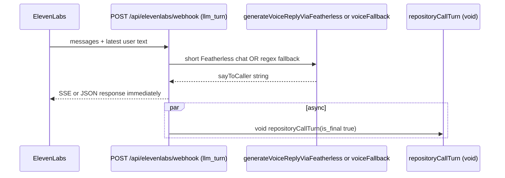

# Current Triage Agent Runtime

This document describes **how call triage runs today** in code: entry points, contracts, providers, the bounded tool loop, persistence, and integration with ElevenLabs/Twilio. **Backend-wide routing** is summarized in `docs/backend_architecture_current.md`; claims below were **verified against source**, not inferred from that doc alone.

**Terminology (strict usage)**

- **Bounded semi-agentic workflow**: Up to **two** LLM completions per final turn, with **backend-owned** tool execution between passes and **Zod validation** after each model JSON return — not provider-native tool rounds and not an open-ended agent loop (`runTriageWithToolLoop` in `lib/db/call-repository.ts`).
- **Hardcoded / deterministic**: Keyword + branch logic with fixed outputs — **`mockCallTriageAgent`** (`lib/ai/agents/mockCallTriageAgent.ts`).
- **System-prompted**: Primary behavior for real providers comes from **`buildCallTriageSystemPrompt`** (`lib/ai/prompts/callTriagePrompt.ts`) plus **`buildTriageUserMessage`** (`lib/ai/providers/gemmaClient.ts`) embedding incident/session/transcript/tool JSON.
- **Mocked**: Tool executors backed by static/demo data (`lib/tools/*`).
- **Disconnected**: Logic exists but is not wired to downstream effects (e.g. EL voice path never consumes validated **`say_to_caller`**).

---

## 1. Executive Summary

**What the triage agent currently is**

- A **JSON-only decision function** shaped by **`triageAgentOutputSchema`** (`lib/ai/schemas/triageAgentOutputSchema.ts`), produced by **`runCallTriageAgentWithProvenance`** (`lib/ai/agents/callTriageAgent.ts`) inside a **two-pass maximum** orchestrator **`runTriageWithToolLoop`** (`lib/db/call-repository.ts`) when **`repositoryCallTurn`** processes a **final** caller turn (`lib/db/call-repository.ts`).

**What it can do**

- Propose **`incident_patch`** / **`call_session_patch`** fields, **`tool_requests`** for registered tools, **`system_actions`** (enum-constrained), and a required **`say_to_caller`** string — all validated by **`validateTriageAgentOutput`** (same schema file).
- Drive **mock or LLM** reasoning; LLM path uses **Featherless** (`generateTriageJsonViaFeatherless`, `lib/ai/providers/featherlessClient.ts`) or **Gemma** (`generateTriageJsonViaGemma`, `lib/ai/providers/gemmaClient.ts`) with **`mockCallTriageAgent`** fallback on missing keys, HTTP errors, or **`validateTriageAgentOutput`** throw (`lib/ai/agents/callTriageAgent.ts`).
- Execute **first-pass** **`tool_requests`** via **`executeAllowedToolRequests`** (`lib/ai/executeAllowedToolRequests.ts`) and feed **`tool_results`** into pass 2 through **`CallTriageAgentInput.toolResults`** (`lib/ai/agents/types.ts`, **`buildTriageUserMessage`**).
- Merge patches with backend rules via **`applyIncidentPatch`** / **`applyCallSessionPatch`** (`lib/server/merge-triage-output.ts`), then apply **`applyTransferGate`** (`lib/server/transferGate.ts`).
- Persist updates through **`repositoryCallTurn`** to Supabase or **`demo-store`** (`lib/db/call-repository.ts`).

**What it cannot do (today)**

- **Native provider tool calling** (OpenAI-style function calling loop) — tools appear only as **JSON fields** in **`TriageAgentOutput.tool_requests`**.
- **More than two** LLM calls per final turn; **second-pass `tool_requests` are not executed** (comment in **`runTriageWithToolLoop`**, `lib/db/call-repository.ts`).
- **Automatic Twilio transfer** as a direct side effect of **`repositoryCallTurn`** — transfer **approval** mutates incident/session fields and returns **`actions`**, but **`POST /api/call/turn`** only returns JSON; **`POST /api/elevenlabs/webhook`** **`llm_turn`** does **not** await triage and uses a **separate** voice model (**Disconnected** from validated **`say_to_caller`**).

**Agentic classification**

- **Not fully agentic**: capped passes, no recursive tool loop, backend validates/filters patches and owns session lifecycle fields (`applyCallSessionPatch` ignores `status` / `operator_transfer_status` / `ai_active` from model — `lib/server/merge-triage-output.ts`).
- **Semi-agentic / bounded**: LLM proposes structured state + tool requests; backend executes tools once and may run a second completion.

**Biggest gaps vs a “final product brain”**

1. **Split brain** between ElevenLabs **voice** completion and **`repositoryCallTurn`** structured output (`app/api/elevenlabs/webhook/route.ts`).
2. **Silent provider downgrade** to **`mockCallTriageAgent`** with **`used_provider: "mock"`** and **`provider_error`** only visible in audit/trace paths — not necessarily obvious in ops logs alone.
3. **Mock tools** (`lib/tools/*`) do not reflect production GIS/responders.
4. **`applyTransferGate`** can set **`transferApproved`** without any guaranteed **Twilio bridge** from the live EL **`llm_turn`** path (**Disconnected**).

---

## 2. Current Triage Entry Points

| Entry Point | File | Calls Triage? | Sync or Async? | Output Used For | Gap |
|-------------|------|---------------|----------------|-----------------|-----|
| `POST /api/call/turn` | `app/api/call/turn/route.ts` | Yes — **`repositoryCallTurn`** → **`runTriageWithToolLoop`** when **`is_final`** | **Sync** await full triage + DB write before HTTP response | Response **`say_to_caller`**, **`incident`**, **`call_session`**, **`actions`**, **`triage_trace`** | Caller on PSTN does not hear this unless another layer speaks it |
| `POST /api/elevenlabs/webhook` (`kind === "llm_turn"`) | `app/api/elevenlabs/webhook/route.ts` | Yes — **`void repositoryCallTurn(...)`** (fire-and-forget) after HTTP response path setup | **Async** relative to EL reply; triage **not awaited** before **`buildLlmResponse`** | **`generateVoiceReplyViaFeatherless`** / **`voiceFallback`** returned to EL; triage updates DB + **`patchVoiceTriageState`** separately | **Disconnected**: spoken text ≠ validated **`say_to_caller`** |
| `POST /api/elevenlabs/webhook` (`kind === "transcript"`) | `app/api/elevenlabs/webhook/route.ts` | Yes — **`await repositoryCallTurn`** | **Sync** | Persists transcript + triage | Narrow payload path; session must exist in **`voiceSessionStore`** |
| `POST /api/dev/triage-preview` | `app/api/dev/triage-preview/route.ts` | Yes — **`runVoiceSimTriagePreview`** (`lib/simulate/voice-sim-triage-server.ts`) | **Sync** | JSON preview only | **No tool loop**: calls **`runCallTriageAgent`** only — **not** **`runTriageWithToolLoop`**; tools never execute |
| Vitest | `lib/ai/agents/callTriageAgent.test.ts`, `mockCallTriageAgent.test.ts`, `lib/db/call-repository.test.ts`, `lib/ai/executeAllowedToolRequests.test.ts` | Direct **`runCallTriageAgent*`**, **`mockCallTriageAgent`**, **`repositoryCallTurn`** | Test harness | Regression coverage | — |

---

## 3. End-to-End Triage Flow

**Canonical path: final turn via `repositoryCallTurn` (Supabase or demo-store)**

1. Route or webhook builds **`CallTurnRequest`** and calls **`repositoryCallTurn`** (`lib/db/call-repository.ts`).
2. **`appendTranscriptSupabase`** / demo **`appendTranscriptEvent`** stores caller text; non-final returns early with **`say_to_caller`** from **`session.next_question`** (no triage).
3. Final turn: load **prior transcript texts** (`listTranscriptTextsSupabase` or **`getTranscriptHistoryForSession`**), excluding current event id where applicable.
4. **`runTriageWithToolLoop`**: pass 1 **`runCallTriageAgentWithProvenance`** → optional **`executeAllowedToolRequests`** → pass 2 **`runCallTriageAgentWithProvenance`** with **`toolResults`**.
5. **`applyTriagePatchesAndGate`**: **`hydrateIncidentPatchFromToolResults`** → **`applyIncidentPatch`** → **`applyCallSessionPatch`** → **`applyTransferGate`** (`lib/db/call-repository.ts`).
6. Persist incident/session; **`insertAudit`** / **`newAuditLog`** with **`buildTriageAuditPatch`**; **`appendTransferGateAudits`**.
7. If **`aiOutput.say_to_caller`** non-empty, append **`transcript_events`** row with **`speaker: "ai"`** (`AI_TRANSCRIPT_SPEAKER` constant in `call-repository.ts`).

```mermaid
sequenceDiagram
  participant API as Next.js route handler
  participant Repo as repositoryCallTurn
  participant Loop as runTriageWithToolLoop
  participant Agent as runCallTriageAgentWithProvenance
  participant Tools as executeAllowedToolRequests
  participant Merge as applyIncidentPatch applyCallSessionPatch
  participant Gate as applyTransferGate
  participant DB as Supabase or demo-store

  API->>Repo: POST body / EL event
  Repo->>DB: insert transcript row / append event
  alt is_final false
    Repo-->>API: next_question, no triage
  else is_final true
    Repo->>Loop: latestTranscript + transcriptHistory + mode + AI_PROVIDER
    Loop->>Agent: pass 1 (no toolResults)
    Agent-->>Loop: TriageAgentOutput or fallback mock
    alt tool_requests non-empty
      Loop->>Tools: executeAllowedToolRequests
      Tools-->>Loop: ToolResult[]
      Loop->>Agent: pass 2 (toolResults in user payload)
      Agent-->>Loop: final TriageAgentOutput
    end
    Loop-->>Repo: TwoPassTriageOutcome
    Repo->>Merge: patches from output + tool hydration
    Merge->>Gate: system_actions + patched entities
    Gate-->>Repo: gated incident/session + actions
    Repo->>DB: update incidents/call_sessions audit_logs transcript_events optional ai line
    Repo-->>API: say_to_caller incident call_session actions triage_trace
  end
```

**ElevenLabs `llm_turn` (voice + async triage)** — real combined behavior:



---

## 4. Triage Agent Input Contract

Data flows through **`CallTriageAgentInput`** (`lib/ai/agents/types.ts`):

| Input Field | Source | Used By | Notes |
|-------------|--------|---------|-------|
| **`latestTranscript`** | HTTP **`text` / `final_transcript`** (`repositoryCallTurn`), or dev preview body | **`extractTranscriptText`** / **`extractText`** (Gemma + mock) | Always the **current** turn text string |
| **`transcriptHistory`** | Prior **`transcript_events.text`** list (`repositoryCallTurn`) or preview/sim arrays | **`buildTriageUserMessage`** JSON **`transcript_history`**; **`mockCallTriageAgent`** concatenates for keywords | Mock joins history + latest for **`fullTranscript`** matching (`mockCallTriageAgent`) |
| **`incident`** | Loaded row before triage (`repositoryCallTurn`) | Embedded in user JSON context (**`buildTriageUserMessage`**) | Partial/incumbent fields guide LLM; merge rules still apply server-side |
| **`callSession`** | Loaded session row | Same | **`applyCallSessionPatch`** strips dangerous keys |
| **`mode`** | **`incident.mode`** default | **`buildCallTriageSystemPrompt(mode)`** filters tool catalog (`toolCatalog.ts`) | Invalid **`AI_PROVIDER`** string ⇒ **`normalizeProvider`** forces **`mock`** (`callTriageAgent.ts`) |
| **`provider`** | **`process.env.AI_PROVIDER`** passed from **`repositoryCallTurn`** | **`runCallTriageAgentWithProvenance`** | Preview route may override per request body (`voice-sim-triage-server.ts`) |
| **`toolResults`** | Populated only on **pass 2** (`runTriageWithToolLoop`) | **`buildTriageUserMessage`** includes **`tool_results`** array | **Absent** on pass 1 and **absent** in **`runVoiceSimTriagePreview`** |
| **ElevenLabs conversation / Twilio metadata** | **Not passed** into **`CallTriageAgentInput`** | — | **Gap**: triage does not see raw EL payloads or Twilio SIDs |

---

## 5. Triage Agent Output Contract

Schema: **`triageAgentOutputSchema`** (`lib/ai/schemas/triageAgentOutputSchema.ts`). Top-level keys: **`tool_requests`**, **`incident_patch`**, **`call_session_patch`**, **`system_actions`**, **`say_to_caller`** (required non-empty string).

| Output Field | Purpose | Used By Backend? | Used By Frontend? | Notes/Gaps |
|--------------|---------|------------------|-------------------|------------|
| **`incident_patch`** | Partial incident update proposal | Yes — **`applyIncidentPatch`** (`merge-triage-output.ts`) | Indirectly via refreshed **`incident`** in API responses / realtime | **`urgency`** cannot downgrade; **`status`/`control_state`** whitelisted; **`ai_active`** ignored |
| **`incident_patch.urgency`** | Risk ladder | Yes — **`mergeUrgency`** | Dashboard displays urgency | — |
| **`incident_patch.incident_type`** | Classification string | Yes | Dashboard | Free string from model |
| **`incident_patch.location`**, **`coordinates`**, **`location_status`**, **`location_confidence`** | Location state | Yes | Map pins if coords present | **`hydrateIncidentPatchFromToolResults`** may inject **`location_confidence`** from geocode tool (`call-repository.ts`) |
| **`missing_fields`**, **`collected_fields`** | Intake tracking | Yes | Drawer/UI if bound | Merged with server rules for **`collected_fields`** |
| **`summary`**, **`recommended_action`** | Narrative | Yes | UI | — |
| **`call_session_patch`** | Session hints | Partial — **`applyCallSessionPatch`** drops **`status`**, **`operator_transfer_status`**, **`ai_active`** (`merge-triage-output.ts`) | — | Model cannot directly set transfer lifecycle fields |
| **`say_to_caller`** | Caller-facing line | Yes — stored as **`ai`** transcript line in **`repositoryCallTurn`**; returned in **`POST /api/call/turn`** | Simulator may display | **Not** spoken on EL **`llm_turn`** (Disconnected) |
| **`tool_requests`** | Request backend tools | Pass 1 executed; pass 2 **not** re-dispatched (`runTriageWithToolLoop` comments) | Trace in **`triage_trace`** | Unknown tools ⇒ **`ToolResult`** errors (`executeAllowedToolRequests.ts`) |
| **`system_actions`** | Proposed side effects enum | **`applyTransferGate`** inspects **`transfer_to_operator`**; full action list not executed as separate dispatch from repo | — | Mock keeps **`[]`**; critical mock paths still set **`operator_required: true`** (`mockCallTriageAgent.ts`) |

**Provenance (not in Zod schema output object)**

- Captured in **`TriageTrace`** / audit JSON: **`requested_provider`**, **`pass1_provider`**, **`pass2_provider`**, **`pass*_provider_error`**, **`second_pass_error`** (`buildTriageTrace`, **`buildTriageAuditPatch`** in `call-repository.ts`; type **`TriageTrace`** in `lib/types/api.ts`).

---

## 6. Provider Behavior

| Provider | Real Model? | Function/File | Fallback Behavior | Risk |
|----------|-------------|---------------|-------------------|------|
| **`mock`** | No — **Hardcoded/deterministic** | **`mockCallTriageAgent`** (`lib/ai/agents/mockCallTriageAgent.ts`) via **`runMockFallback`** | N/A | **`system_actions`** always **`[]`**; escalation relies on **`operator_required`** + gate |
| **`featherless`** | Yes (remote HTTP) | **`generateTriageJsonViaFeatherless`** (`lib/ai/providers/featherlessClient.ts`) | Missing **`FEATHERLESS_API_KEY`** / **`FEATHERLESS_MODEL`**, fetch/timeout errors, or **`validateTriageAgentOutput`** throw ⇒ **`mockCallTriageAgent`** with **`provider_error`** (`callTriageAgent.ts`) | Silent downgrade if **`provider_error`** not monitored |
| **`gemma`** | Yes (Google Generative Language API) | **`generateTriageJsonViaGemma`** (`lib/ai/providers/gemmaClient.ts`) | Missing **`GEMMA_API_KEY`** or errors ⇒ mock + **`provider_error`** | Same |

**Environment variables (non-exhaustive)**

- **`AI_PROVIDER`**: **`mock` \| `gemma` \| `featherless`** (unknown ⇒ **`mock`**, `normalizeProvider` in `callTriageAgent.ts`).
- **Featherless**: **`FEATHERLESS_API_KEY`**, **`FEATHERLESS_MODEL`**, **`FEATHERLESS_BASE_URL`**, optional **`FEATHERLESS_JSON_RESPONSE`**, **`FEATHERLESS_HTTP_REFERER`**, **`FEATHERLESS_X_TITLE`** (`featherlessClient.ts`).
- **Gemma**: **`GEMMA_API_KEY`**, **`GEMMA_MODEL`** (`gemmaClient.ts`).

**Fallback visibility**

- **`repositoryCallTurn`** persists **`buildTriageAuditPatch`** including **`pass1_provider_error`** / **`pass2_provider_error`** (`call-repository.ts`).
- **`POST /api/call/turn`** returns **`triage_trace`** to clients (`app/api/call/turn/route.ts`, `CallTurnResponse` in `lib/types/api.ts`).
- ElevenLabs **`llm_turn`** **does not return** **`triage_trace`** to the caller.

---

## 7. Prompt / System Instruction Behavior

**Construction**

- **`buildCallTriageSystemPrompt(mode)`** = static **`callTriageSystemPrompt`** + **`buildToolCatalogForPrompt(mode)`** + **`DEMO_TOOL_HINT`** (`callTriagePrompt.ts`, `toolCatalog.ts`).
- User message = **`buildTriageUserMessage(input)`** — JSON blob with **`mode`**, **`incident`**, **`call_session`**, **`transcript_history`**, **`latest_transcript`**, optional **`tool_results`** (`gemmaClient.ts`).

**What the system prompt enforces (summary)**

- Declares **controlled agent**: model **does not** touch DB/APIs; backend validates (**`callTriagePrompt.ts`** CONTROL BOUNDARIES section).
- Specifies **strict JSON** output keys matching **`TriageAgentOutput`**.
- Enumerates **enum** constraints aligned with Zod (`callTriagePrompt.ts`).
- Embeds **tool catalog** from **`listToolDefinitions`** filtered by **`isModeAllowed`** — mirrors **`executeAllowedToolRequests`** enforcement (`toolCatalog.ts`).

**Freedom vs schema**

- Model chooses **values** within schema and may propose **`tool_requests`** / **`system_actions`**, but backend **merges**, **filters**, and **gates** — **system-prompted** intent with **hard backend constraints**.

**Safety**

- Prompt warns against unsafe **`say_to_caller`** content; **`applyIncidentPatch`** additionally prevents downgrade/human lifecycle jumps (`merge-triage-output.ts`).

---

## 8. Tool-Calling Behavior

**Direct answers**

| Question | Answer |
|----------|--------|
| Does the model call tools natively? | **No** — no provider **`tools`** / function-call API for triage (`featherlessClient.ts`, `gemmaClient.ts` use plain completions). |
| Does the model request tools through JSON? | **Yes** — **`tool_requests`** array on **`TriageAgentOutput`**. |
| Who validates tool requests? | **`executeAllowedToolRequests`** normalizes, checks registry, Zod-args, mode, timeout (`executeAllowedToolRequests.ts`). |
| Who executes tools? | Registered **`executor`** functions in **`toolRegistry.ts`** only. |
| Are tool results fed back? | **Yes** — pass 2 **`runCallTriageAgentWithProvenance`** receives **`toolResults`** via **`buildTriageUserMessage`**. |
| How many passes? | **Two model calls maximum** (`runTriageWithToolLoop`). |
| Second-pass **`tool_requests`** executed? | **No** — ignored by dispatcher (explicit comment, `call-repository.ts`). |

| Tool | File | Current Implementation | Real/Mock/Hardcoded | Used By Triage? |
|------|------|------------------------|---------------------|----------------|
| **`geocode_location`** | `lib/tools/geocodeLocation.ts` | Landmark substring + deterministic jitter | **Mocked** | Yes — when requested |
| **`responder_lookup`** | `lib/tools/responderLookup.ts` | Ranks **`getMockResponders()`** | **Mocked** | Yes |
| **`event_zone_lookup`** | `lib/tools/eventZoneLookup.ts` | Static bbox list **`EVENT_ZONES`** | **Mocked** | Yes — disaster/world_cup modes only per registry |
| **`sms_draft`** | `lib/tools/smsDraft.ts` | String templating | **Hardcoded template** | Yes |
| **Mapbox MCP** | — | **Not found** in `toolRegistry.ts` | **Referenced only** in broader docs/types (e.g. execution source enums elsewhere) | **No** executor wired |

---

## 9. Split-Brain Analysis

| Question | Answer |
|----------|--------|
| Does ElevenLabs speak **`say_to_caller`** from validated triage on **`llm_turn`? | **No.** Spoken text is **`generateVoiceReplyViaFeatherless`** or **`voiceFallback`** (`app/api/elevenlabs/webhook/route.ts`). |
| Is structured triage synchronous on live EL Custom LLM path? | **No.** **`void repositoryCallTurn`** runs **after** response assembly intent (async). |
| Can caller response and DB diverge? | **Yes** — different models, different prompts, async timing, and optional IBM translation on voice path only. |
| Files | **`app/api/elevenlabs/webhook/route.ts`**, **`lib/db/call-repository.ts`**, **`lib/ai/providers/featherlessClient.ts`** (triage) vs inline **`generateVoiceReplyViaFeatherless`** in webhook file (voice). |
| Change direction | **Single source of truth**: await **`repositoryCallTurn`** before EL response (latency cost), or synthesize EL reply strictly from validated **`say_to_caller`** / templates derived from gated output. |

---

## 10. Transfer / Escalation Analysis

**How triage marks escalation**

- **`incident_patch.operator_required`**, **`call_session_patch.should_escalate`**, **`system_actions`** including **`transfer_to_operator`** (prompt + schema).

**Mock behavior**

- **`system_actions`** always **`[]`** (`mockCallTriageAgent.ts`).
- Critical drafts set **`operator_required: true`** (e.g. **`activeBreakInDraft`**, `mockCallTriageAgent.ts`).

**Transfer gate**

- **`applyTransferGate`** (`lib/server/transferGate.ts`) combines **`system_actions`** OR **`operator_required`**, then enforces **location known**, **`mode === "normal"`**, and **`getOperatorAvailability() === "free"`** (`operatorAvailability.ts`).

**Live EL path**

- **`shouldTransfer`** / **`shouldEnd`** **hardcoded `false`** (`app/api/elevenlabs/webhook/route.ts`) — **`triggerTransfer`** never selected.

**Does emergency transfer “work from triage today”?**

- **Partially / Disconnected**: **`repositoryCallTurn`** can compute **`gated.transferApproved`** and return **`actions`** including transfer intent, but **nothing in `repositoryCallTurn`** invokes Twilio. **`POST /api/twilio/transfer`** must be called separately (EL **`llm_turn`** currently **does not**). Therefore **end-to-end automatic bridging from live EL voice + triage is not implemented**.

---

## 11. Statefulness Analysis

| Context | Available? | Mechanism |
|---------|------------|-----------|
| Prior transcript text | **Yes** | **`transcriptHistory`** array from DB/demo-store (`repositoryCallTurn`) |
| Full **`Incident`** row | **Yes** | Reloaded before triage; embedded in LLM user JSON |
| Full **`CallSession`** row | **Yes** | Same |
| **`missing_fields` / `collected_fields`** across turns | **Yes** | Persisted on incident; fed back as **`incident`** on next turn |
| Prior **`tool_results`** across turns | **No** as explicit memory | Only within a single **`runTriageWithToolLoop`** second pass |
| Prior raw **`TriageAgentOutput`** | **No** direct field | Only indirectly via merged incident/session state |
| ElevenLabs **`patchVoiceTriageState`** cache | **Parallel / side channel** | **`voiceSessionStore`** (`lib/voice/voiceSessionStore.ts`) stores subset for **voice** Featherless — **not** passed into **`CallTriageAgentInput`** |

---

## 12. Auditability / Observability

**Stored per final triage (`repositoryCallTurn`)**

- **`transcript_events`**: caller line + optional **`ai`** **`say_to_caller`** echo (`call-repository.ts`).
- **`audit_logs`**: **`call_turn_final`** with **`buildTriageAuditPatch`** (tool requests, normalized requests, tool results, provider errors, **`second_pass_error`**, **`system_actions`**).
- **`audit_logs`**: **`transfer_requested`** / **`transfer_suppressed`** when gate fires (**`appendTransferGateAudits`**).

**Returned to synchronous API clients**

- **`triage_trace`** on **`POST /api/call/turn`** (`app/api/call/turn/route.ts`).

**Gaps**

- ElevenLabs **`llm_turn`** lacks **`triage_trace`** in HTTP response.
- Async **`void repositoryCallTurn`** failures log to **`console.error`** only (`elevenlabs/webhook/route.ts`).
- No persisted row-level **validation issue dump** when mock fallback masks LLM **`validateTriageAgentOutput`** failure beyond **`provider_error`** string.

---

## 13. Current Triage Problems

1. **Split brain (voice vs structured)** — Operators/heard speech disagree with DB **`say_to_caller`**. **Files:** `app/api/elevenlabs/webhook/route.ts`, `lib/db/call-repository.ts`. **Fix:** unify response source or await triage before EL reply.

2. **Dev preview misleading** — **`runVoiceSimTriagePreview`** skips **`runTriageWithToolLoop`**. **Files:** `lib/simulate/voice-sim-triage-server.ts`. **Fix:** call **`runTriageWithToolLoop`** or rename/document limitation.

3. **Silent mock downgrade** — **`provider_error`** only in audit/trace. **Files:** `lib/ai/agents/callTriageAgent.ts`. **Fix:** surface in metrics/alerts or fail closed in prod config.

4. **Mock tools** — Misleading “geo” and “responder” fidelity. **Files:** `lib/tools/*`. **Fix:** swap executors, keep schema/registry.

5. **Transfer disconnected from EL voice** — **`shouldTransfer`** constants. **Files:** `app/api/elevenlabs/webhook/route.ts`. **Fix:** wire to **`repositoryCallTurn`** outcome or synchronous triage.

6. **Two-pass tool stall** — Second-pass tool wishes ignored. **Files:** `lib/db/call-repository.ts`. **Fix:** document or extend loop explicitly if needed.

7. **State gap** — No EL/Twilio metadata in triage input. **Files:** `lib/ai/agents/types.ts`. **Fix:** extend input cautiously (PII).

---

## 14. What the Final Triage Agent Should Become

*(**Target architecture** — not current implementation.)*

- **One source of truth** for caller-facing audio/text: derived from **validated** **`TriageAgentOutput`** after backend merge/gate, not a parallel ad-hoc completion.
- **Structured command object** remains schema-first; backend remains authoritative on persistence, transfer, SMS, and external APIs.
- **Backend validation** expands as needed (business rules, consent, jurisdiction) without prompt drift being sole enforcement.
- **Geospatial tools** backed by real services (e.g. Mapbox Geocoding / routing) or MCP-backed executors **behind the same registry pattern** — replacing mocked **`lib/tools`** implementations.
- **Transfer recommendation** flows from gated **`system_actions` / `operator_required`** into an **explicit, audited** telephony step (Twilio) when approved.
- **Audited trace** spans model IDs, latency, raw JSON (redacted), validation errors, tool I/O, and gate decisions — durable and queryable.
- **Voice layer** reads **approved **`say_to_caller`** (or a template policy tied to it)** so playback matches incident state.

---

## Evidence Appendix

**Core agent & schema**

- `lib/ai/agents/callTriageAgent.ts`, `lib/ai/agents/mockCallTriageAgent.ts`, `lib/ai/agents/types.ts`
- `lib/ai/schemas/triageAgentOutputSchema.ts`
- `lib/ai/prompts/callTriagePrompt.ts`, `lib/ai/prompts/toolCatalog.ts`
- `lib/ai/providers/featherlessClient.ts`, `lib/ai/providers/gemmaClient.ts`

**Tools & dispatch**

- `lib/ai/toolRegistry.ts`, `lib/ai/executeAllowedToolRequests.ts`
- `lib/tools/geocodeLocation.ts`, `lib/tools/responderLookup.ts`, `lib/tools/eventZoneLookup.ts`, `lib/tools/smsDraft.ts`, `lib/tools/_mockGeo.ts`

**Repository & merge/gate**

- `lib/db/call-repository.ts` (**`runTriageWithToolLoop`**, **`repositoryCallTurn`**, **`buildTriageAuditPatch`**, **`buildTriageTrace`**)
- `lib/server/merge-triage-output.ts`, `lib/server/transferGate.ts`, `lib/server/operatorAvailability.ts`

**Routes**

- `app/api/call/turn/route.ts`, `app/api/elevenlabs/webhook/route.ts`, `app/api/dev/triage-preview/route.ts`

**Simulation / preview**

- `lib/simulate/voice-sim-triage-server.ts`

**Types**

- `lib/types/api.ts` (**`TriageTrace`**, **`CallTurnResponse`**)

**Tests**

- `lib/ai/agents/callTriageAgent.test.ts`, `lib/ai/agents/mockCallTriageAgent.test.ts`
- `lib/ai/executeAllowedToolRequests.test.ts`, `lib/db/call-repository.test.ts`

---

*End of document.*
